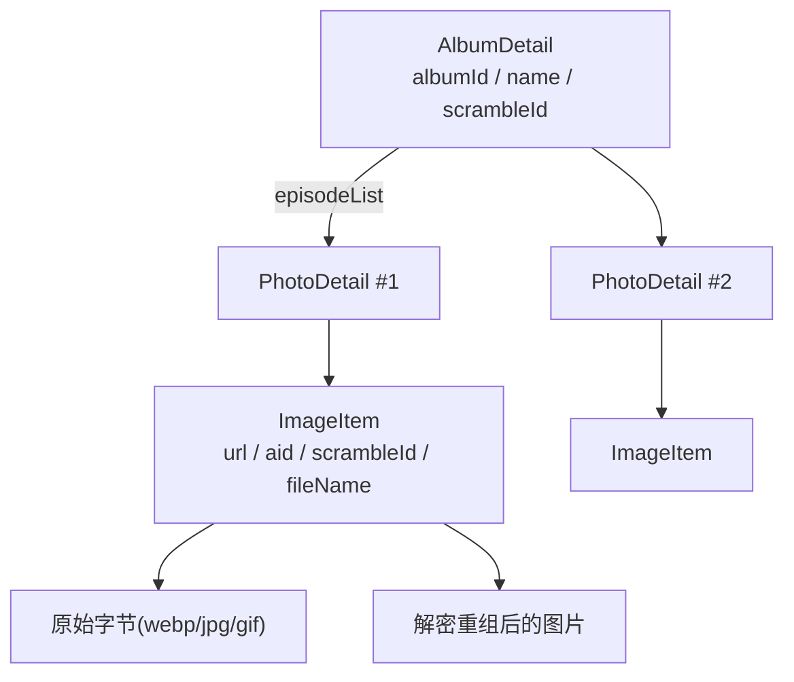
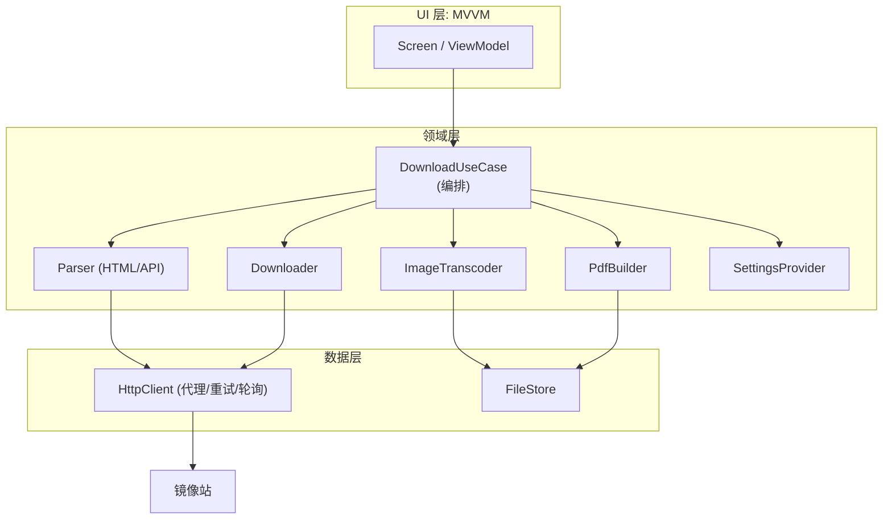

# JMFM 核心逻辑设计文档

> 版本：v1（2026-08-21）
> 用途：重构/重写蓝本。本文档只描述核心逻辑（解析、下载、解密/转码、PDF 生成），不涉及具体 UI 实现。
> 来源：从当前 Android 实现（`JMcomicDownloader.java`）与参考实现（`app/sampledata/core/` 的 jmcomic Python 库）中提炼。
>
> 文档体系：
> - [PROJECT_ANALYSIS.md](PROJECT_ANALYSIS.md)：项目现状与缺陷清单
> - **CORE_DESIGN.md（本文）**：核心逻辑设计（解析/下载/解密转码/PDF）
> - [REFACTOR_ROADMAP.md](REFACTOR_ROADMAP.md)：分阶段重构路线图

---

## 1. 领域模型

| 实体 | 关键字段 | 说明 |
|---|---|---|
| `AlbumDetail` | `albumId`、`name`、`scrambleId`、`episodeList` | 一个本子（专辑），包含多个章节 |
| `PhotoDetail`（章节） | `photoId`、`name`、`sort`、`scrambleId`、`pageArr`、`cdnBaseUrl` | 单章节，`pageArr` 是该章所有图片文件名 |
| `ImageItem` | `aid`、`scrambleId`、`url`、`fileName`（不含后缀） | 单张图片，`aid` 即章节所属专辑 id，用于解密参数计算 |



---

## 2. 整体数据流

```
输入 albumId
  → [解析] GET /album/{albumId}             → AlbumDetail（含章节列表）
  → [解析] GET /photo/{chapterId}（逐章）    → PhotoDetail（含图片文件名数组 + CDN base）
  → [下载] 并发下载每张图片字节
  → [转码] webp→PNG / gif 直存 / 按需解密重组
  → [合成] 全部图片合并为单个 PDF（A4，等比居中）
  → 输出 PDF 文件
```

进度阶段划分（供 UI 展示）：`0 开始 → 20 解析专辑 → 40 章节解析 → 50-70 图片下载 → 75-95 PDF 合成 → 100 完成`。

---

## 3. 解析模块

### 3.1 专辑页 `GET /album/{albumId}`

- **注意**：专辑页 HTML 可能被 Base64 编码包裹：`const html = base64DecodeUtf8("...")`，需先提取并 Base64 解码后再解析（当前 Android 实现缺失此步，只判断了 `response.contains("album")`）。
- 提取字段（正则，参考 `jm_toolkit.py` `JmcomicText`）：

| 字段 | 正则 | 备注 |
|---|---|---|
| `albumId` | `<span class="number">.*?：JM(\d+)</span>` | |
| `name` | `id="book-name"[^>]*?>([\s\S]*?)<` | |
| `scrambleId` | `var scramble_id = (\d+);` | 专辑级，同专辑章节共用 |
| `episodeList` | `data-album="(\d+)"[^>]*>[\s\S]*?第(\d+)[话話]([\s\S]*?)<[\s\S]*?>` | 每组捕获 (photoId, sort, name) |

### 3.2 章节页 `GET /photo/{chapterId}`

| 字段 | 正则 | 备注 |
|---|---|---|
| `photoId` | `<meta property="og:url" content=".*?/photo/(\d+)/?.*?">` | |
| `scrambleId` | `var scramble_id = (\d+);` | |
| `seriesId/aid` | `var series_id = (\d+);` | 所属专辑 id，用于解密 |
| `pageArr` | `var page_arr = (.*?);` | 图片文件名 JSON 数组，如 `["1.webp","2.webp",...]` |
| `cdnBaseUrl` | `data-original="(.*?)"[^>]*?id="album_photo[^>]*?data-page="0"` | 取第一张图 URL 的目录前缀 |
| `totalPics` | `var total_pics = (\d+);` | 降级解析用 |

**图片 URL 构造规则**：
1. 主方案：`cdnBaseUrl + pageArr[i]`
2. 降级方案（`cdnBaseUrl` 不可得，但 `aid`/`totalPics` 可得）：`https://cdn-msp.jmapiproxy.cc/media/photos/{aid}/{序号:05d}.jpg`，序号从 1 起
3. 最终兜底：若章节页也解析不到，直接使用 `albumId` 作为唯一章节再解析一次

### 3.3 解析实现的工程要求

- 用 **jsoup**（已声明的依赖）替代全部字符串正则，避免脆弱解析与转义问题。
- 所有解析必须幂等、可空安全；任一字段失败不得中断整体流程，应走降级方案。

---

## 4. 下载模块

- **域名轮询**：维护可用域名列表（当前 5 个镜像站），逐个尝试，每个域名先 HTTPS 后 HTTP，每个域名最多 `maxRetries`（默认 3）次，间隔 500ms。
- **请求头**：
  - 通用：`User-Agent: Mozilla/5.0 ...Chrome/...`
  - 图片：`Referer: https://18comic.vip/`、`Accept: image/webp,image/apng,image/*,*/*;q=0.8`
- **代理**：可选 HTTP 代理（`host:port`），所有请求统一走 `Proxy` 通道；代理不可用时回退直连。
- **超时**：连接/读取 30s，`setInstanceFollowRedirects(true)`。
- **并发**：图片下载用固定线程池，并发度 = `min(64, max(2, CPU核数×2))`，且不超过图片总数；可通过设置项覆盖。
- **重试**：单张图片失败重试 3 次，间隔 500ms。

---

## 5. 解密 / 转码模块（核心算法，必须逐字精确）

### 5.1 分割数计算 `getNum(scrambleId, aid, fileName)`

```python
def get_num(scramble_id, aid, filename: str) -> int:
    if aid < scramble_id:
        return 0
    if aid < 268850:
        return 10
    x = 10 if aid < 421926 else 8
    s = md5hex(str(aid) + filename)          # md5 十六进制小写
    v = ord(s[-1]) % x * 2 + 2               # ord(最后一个字符的ascii码)
    return v
```

- `scrambleId`、`aid` 均为整数（`aid` 从图片 URL 中的 `/media/photos/{aid}/` 提取，文件名去掉后缀）。
- 返回值 `num` 为图片被切割的条带数：`0` 表示未切割（无需重组）。

### 5.2 图片重组 `decodeAndSave(num, src)`（水平条带重排）

图片被从上到下切割成 `num` 条，然后**逆序并偏移交错**地重排过。重组算法：

```python
def decode_and_save(num, img_src):
    w, h = img_src.size
    img_out = new_image(w, h)
    over = h % num
    base = floor(h / num)
    for i in range(num):
        move = base
        y_src = h - base * (i + 1) - over
        y_dst = base * i
        if i == 0:
            move += over
        else:
            y_dst += over
        paste(img_src[y_src : y_src + move], to=(0, y_dst))
    save(img_out)
```

注意边界修正：`y_src < 0` 截断为 0；`y_src + move > h` 时 `move` 收窄。

### 5.3 各格式处理策略

| 源格式 | 处理方式 |
|---|---|
| `.gif` | **直存原始字节**，不解码不重组 |
| `.webp` | 解码为 Bitmap；若 `num > 0` 先重组再存 **PNG**；否则直接存 PNG |
| `.jpg/.png` 且 `num > 0` | 解码 → 重组 → 按原扩展名保存（PNG 用 PNG，其余 JPEG，质量 95） |
| `.jpg/.png` 且 `num == 0` | **直存原始字节**（最高效，零解码） |

> 性能关键：`num == 0` 的图片禁止无谓解码，直接写字节流。

---

## 6. PDF 合成模块

- 页面：A4，595×842 pt，白底。
- 每页一张图片，等比缩放后**居中**绘制，缩放 = `min(595/w, 842/h)`。
- 大图（宽 > 1190 或高 > 1684）先按 `inSampleSize` 降采样再解码，防止 OOM。
- 输出文件名：`{sanitize(title)}_{albumId}.pdf`，标题净化非法字符 `<>:"/\|?*`、限长 200、空则 `untitled`。
- 合成期间使用临时目录，完成后整体删除。
- 若采用 fpdf/Pillow 风格（参考实现）：竖图用纵向页、横图用横向页；RGBA/P 模式先铺白底转 RGB，webp/gif 统一转 JPEG(quality 95)。

---

## 7. 移动端 API 通道（可选增强，参考实现已有）

当前 Android 实现只走 HTML 通道。参考实现 `JmApiClient` 额外支持移动端 API，逆向信息如下（**重写时可加，作为 HTML 通道失效时的备用**）：

- 接口：`/album?id={id}`、`/chapter?id={id}`、`/chapter_view_template?id={id}`（scrambleId）。
- 请求头 token 计算：`token = md5(ts + APP_TOKEN_SECRET)`，`tokenparam = "{ts},{ver}"`。
- 响应 `data` 解密：`base64decode(data)` → `AES-ECB(key=md5(ts+APP_DATA_SECRET))` → 去 PKCS7 padding → JSON。
- 关键常量：`APP_VERSION='2.0.6'`、`APP_TOKEN_SECRET='18comicAPP'`、`APP_DATA_SECRET='185Hcomic3PAPP7R'`。
- API 图片域名列表：`cdn-msp.jmapiproxy1.cc`、`cdn-msp.jmapiproxy2.cc`、`cdn-msp2.jmapiproxy2.cc` 等。
- 实体字段映射：album（`id→album_id`、`series→episode_list`）、photo（`id→photo_id`、`images→page_arr`）。

---

## 8. 目标架构建议（重写蓝本）



- 语言：**Kotlin + 协程**（下载流水线用结构化并发 + Flow 上报进度），纯 Java 不再新增。
- 分层：UI（MVVM）→ 领域（用例/接口）→ 数据（HTTP/文件）。
- 核心 5 个模块独立可单测：`Parser`、`Downloader`、`ImageTranscoder`（解密算法）、`PdfBuilder`、`SettingsProvider`。
- 配置外置：域名列表、重试次数、并发数、代理、输出目录全部来自设置提供器，默认值与现状一致。
- 进度/错误用回调接口或 Kotlin `Flow<DownloadEvent>`，UI 层对生命周期安全（协程作用域自动取消）。

---

## 9. 当前实现缺陷清单（重写必须规避）

1. `JMcomicDownloader.java`（713 行）God Class：HTTP/解析/解密/PDF/存储/线程池全混在一起。
2. 章节页被重复请求（`getImageUrls` 与 `getScrambleIdFromChapter` 各请求一次）；`getScrambleIdFromChapter` 内置空回调。
3. HTML 解析用脆弱正则，且专辑页 Base64 解码缺失。
4. `download_path`、`retry_times`、`image_format`、`image_threads` 等设置项**从未被代码读取**，形同虚设。
5. 回调经 `uiHandler.post` 回 UI，Fragment 销毁后 NPE 风险。
6. 死代码：`Gallery*`、`HomeViewModel`、`PdfListAdapter`、Navigation 模板资源、`itextpdf`/`mediarouter` 未使用依赖。
7. 每章 `downloadImages` 都新建一个线程池，资源管理不当。
8. `bookName` 标题未参与 PDF 文件名（仅用 `"漫画_{id}"` 占位）。
9. `minSdk 35` 过高、`android.enableJetifier=true` 过时、release 无 minify 无签名。

---

## 10. 验收标准

- 用同一 albumId，重构前后产出的 PDF 页数与内容一致（图片解密重组结果像素级一致）。
- 所有设置项（路径/重试/并发/格式/代理）真实生效。
- HTML 通道 + （可选）API 通道双实现，任一失效自动切换。
- 核心模块可脱离 Android UI 独立运行与单测。
