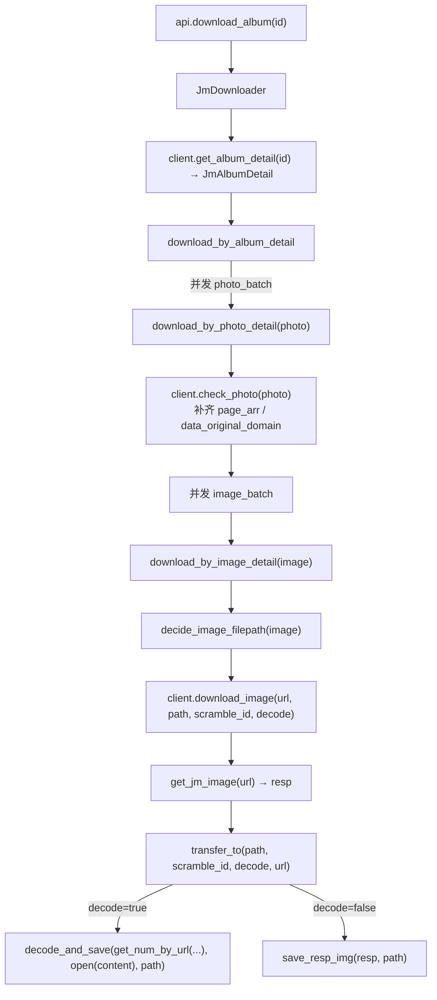

# jmcomic 源码分析 与 Kotlin 转化方案

> 版本：v1（2026-08-21）
> 用途：去掉 Python 作为业务语言，把 jmcomic 库（禁漫天堂下载库，PyPI 版本 2.6.7）转化为 Kotlin 业务代码的依据。
> 相关文档：[PROJECT_ANALYSIS.md](PROJECT_ANALYSIS.md)、[CORE_DESIGN.md](CORE_DESIGN.md)、[REFACTOR_ROADMAP.md](REFACTOR_ROADMAP.md)

---

## 1. jmcomic 库概览

- 源码位置：`app/sampledata/core/src/jmcomic/`（已从 git 恢复，共 7626 行 Python）
- 版本：`2.6.7`
- 依赖（`requirements.txt`）：`PyYAML`、`fpdf2`、`Pillow`、`natsort`、`requests`、`urllib3`、`pycryptodome`（AES）

**模块依赖链**（`__init__.py` 明确标注）：

```
config <--- entity <--- toolkit <--- client <--- option <--- downloader
```

| 模块 | 行数 | 职责 | 关键类 |
|---|---|---|---|
| `jm_config.py` | 507 | 常量 + 全局注册表 | `JmMagicConstants`、`JmModuleConfig` |
| `jm_entity.py` | 697 | 数据实体 | `JmAlbumDetail`、`JmPhotoDetail`、`JmImageDetail`、`Downloadable`、`DetailEntity` |
| `jm_toolkit.py` | 957 | 工具集 | `JmcomicText`(解析)、`JmImageTool`(图片解密)、`JmCryptoTool`(AES/token)、`PackerUtil`、`ExceptionTool` |
| `jm_client_interface.py` | 617 | 客户端接口 + 响应包装 | `JmResp`、`JmImageResp`、`JmApiResp`、`JmImageClient`、`JmDetailClient`、`JmcomicClient` |
| `jm_client_impl.py` | 1227 | 客户端实现 | `AbstractJmClient`(重试)、`JmHtmlClient`(网页)、`JmApiClient`(移动端API)、`FutureClientProxy` |
| `jm_option.py` | 647 | 配置选项 | `JmOption`、`DirRule`、`decide_xxx` |
| `jm_downloader.py` | 350 | 下载调度器 | `JmDownloader`、`DownloadCallback` |
| `jm_plugin.py` | 1308 | 插件系统 | `JmOptionPlugin`（before/after_album/photo/image 钩子） |
| `api.py` | 131 | 对外 API | `download_album`、`download_photo`、`create_option_by_file` |
| `cl.py` | 121 | 命令行 | `JmcomicUI` |

---

## 2. 数据实体模型

```
JmAlbumDetail（本子）
├─ album_id / name / description / author / tags / works / actors
├─ scramble_id（专辑级，同专辑所有章节共用）
└─ episode_list: [(photo_id, sort, name), ...]   ← 章节列表

JmPhotoDetail（章节）
├─ photo_id / name / sort / series_id(=album_id) / scramble_id
├─ page_arr: List[str]                           ← 图片文件名数组 ["00001.webp", ...]
├─ data_original_domain: str                     ← CDN 域名
└─ data_original_query_params: str               ← 图片 URL 的 query 参数 v=时间戳

JmImageDetail（单张图片）
├─ aid(=photo_id) / scramble_id
├─ img_url / img_file_name(无后缀) / img_file_suffix
└─ from_photo / index
```

**图片完整 URL 构造**（`JmPhotoDetail.get_img_data_original`）：

```
https://{data_original_domain}/media/photos/{photo_id}/{img_name}?{query_params}
```

**实体字段映射**（API 通道用 `JmPageTool.parse_entity` 适配）：
- album：`id→album_id`、`series→episode_list`、`likes/tags/works/actors/name/description/author/total_views/comment_total`
- photo：`id→photo_id`、`series_id`、`images→page_arr`、`sort`

---

## 3. 核心数据流



进度与结果记录：`download_success_dict`（成功）、`download_failed_image` / `download_failed_photo`（失败），`raise_if_has_exception` 汇总抛出 `PartialDownloadFailedException`。

---

## 4. 两条数据通道

### 4.1 HTML 网页通道（`JmHtmlClient`）

- 请求：`GET /album/{id}`、`GET /photo/{id}`
- 专辑页 HTML 可能被 Base64 包裹：`const html = base64DecodeUtf8("...")`，解析前先解码（`parse_jm_base64_html`）。
- 解析字段用正则（`JmcomicText`），关键正则见 [CORE_DESIGN.md §3](CORE_DESIGN.md)。

### 4.2 移动端 API 通道（`JmApiClient`）

- 接口：`/album?id={id}`、`/chapter?id={id}`、`/chapter_view_template?id={id}`（scrambleId）
- **请求头 token**（`JmCryptoTool.token_and_tokenparam`）：
  - `tokenparam = "{ts},{ver}"`
  - `token = md5(ts + secret)`
- **响应 data 解密**（`JmCryptoTool.decode_resp_data`）：
  - `base64decode(data)` → `AES-ECB(key=md5(ts + data_secret))` → 去 PKCS7 padding → JSON
- 特殊点：`/chapter_view_template` 接口用 `APP_TOKEN_SECRET_2` 而非 `APP_TOKEN_SECRET`（见 `decide_headers_and_ts`）。
- **API 域名自动更新**：从 `API_URL_DOMAIN_SERVER_LIST` 拉取最新域名，返回文本经 AES 解密（`API_DOMAIN_SERVER_SECRET`）。

### 4.3 关键常量（`JmMagicConstants`）

| 常量 | 值 | 用途 |
|---|---|---|
| `SCRAMBLE_220980` | 220980 | 图片分割参数基准 |
| `SCRAMBLE_268850` | 268850 | 分割算法分界 1 |
| `SCRAMBLE_421926` | 421926 | 分割算法分界 2（2023-02-08 后） |
| `APP_TOKEN_SECRET` | `18comicAPP` | 接口 token 密钥 |
| `APP_TOKEN_SECRET_2` | `18comicAPPContent` | scramble 接口专用 |
| `APP_DATA_SECRET` | `185Hcomic3PAPP7R` | 响应 data 解密密钥 |
| `API_DOMAIN_SERVER_SECRET` | `diosfjckwpqpdfjkvnqQjsik` | 域名服务器解密密钥 |
| `APP_VERSION` | `2.0.6` | app 版本 |

**域名**：
- HTML 网页域名（动态获取，用户要求固定的备用列表）：`18comic-mygo.vip`、`18comic-mygo.org`、`18comic-MHWs.CC`、`jmcomic-zzz.one`、`jmcomic-zzz.org`
- 移动端图片 CDN：`cdn-msp.jmapiproxy1.cc`、`cdn-msp.jmapiproxy2.cc`、`cdn-msp2.jmapiproxy2.cc`、`cdn-msp3.jmapiproxy2.cc`、`cdn-msp.jmapinodeudzn.net`、`cdn-msp3.jmapinodeudzn.net`
- 移动端 API：`www.cdnaspa.vip`、`www.cdnaspa.club`、`www.cdnplaystation6.vip`、`www.cdnplaystation6.cc`

---

## 5. 核心算法（转化时必须逐字精确）

### 5.1 分割数 `JmImageTool.get_num(scramble_id, aid, filename)`

```python
if aid < scramble_id:      return 0
if aid < 268850:           return 10
x = 10 if aid < 421926 else 8
s = md5hex(str(aid) + filename)   # md5 十六进制小写
return ord(s[-1]) % x * 2 + 2     # 末字符 ASCII % x * 2 + 2
```

### 5.2 图片重组 `JmImageTool.decode_and_save(num, img_src, path)`

水平条带逆序交错重组：

```python
if num == 0: save(img_src, path); return
w, h = img_src.size
img_out = new(w, h)
over = h % num
base = floor(h / num)
for i in range(num):
    move = base
    y_src = h - base * (i + 1) - over
    y_dst = base * i
    if i == 0:  move += over
    else:       y_dst += over
    paste(img_src.crop(0, y_src, w, y_src+move), to=(0, y_dst))
save(img_out, path)
```

### 5.3 保存策略 `JmImageResp.transfer_to`

- 不需要解码（`decode_image=False` 或 `scramble_id=None`）：直接存字节，若后缀不匹配则转格式（`need_convert=suffix_not_equal(url, path)`）。
- 需要解码：`decode_and_save(get_num_by_url(scramble_id, url), open(content), path)`。
- gif 特判：`img_is_not_need_to_decode` 判断 `.gif` 结尾则不解码（`JmImageClient.img_is_not_need_to_decode`）。

---

## 6. 下载调度器（`JmDownloader`）

- **并发模型**：`execute_on_condition` 根据 `count_batch` 决定——超过总量则「一对象一线程」，否则用 `count_batch` 线程池。
- **缓存**：`use_cache=True 且文件已存在` 则跳过下载。
- **过滤**：`do_filter` 钩子支持只下载某章/某几张图。
- **回调钩子**：`before/after_album`、`before/after_photo`、`before/after_image`，同时触发插件链 `call_all_plugin`。
- **异常收集**：`catch_exception` 装饰器把图片/章节失败分别记入 `download_failed_image/photo`。

---

## 7. Kotlin 转化方案

### 7.1 框架推荐（明确推荐，理由见下）

| 职责 | Python（原） | Kotlin 推荐 | 理由 |
|---|---|---|---|
| HTTP 客户端 | requests / urllib3 | **OkHttp 4.x** | 连接池、拦截器可优雅实现「域名轮询 + 重试 + 代理 + headers」，Android 事实标准 |
| HTML 解析 | 正则 | **jsoup** | 替代脆弱正则，健壮、可空安全 |
| JSON / 配置序列化 | json.loads + PyYAML | **kotlinx.serialization**（JSON）+ **DataStore**（配置） | 类型安全，替代 `AdvancedDict` 鸭子类型 |
| 并发 | threading + 自写线程池 | **Kotlin 协程 + Flow** | 结构化并发、天然取消、Flow 上报进度，替代回调地狱 |
| 图片编解码 | Pillow | **android.graphics.Bitmap + Canvas** | Android 原生，零额外依赖 |
| PDF | fpdf2 | **android.graphics.pdf.PdfDocument** | Android 原生 |
| 加密 / 哈希 | pycryptodome + hashlib | **javax.crypto.Cipher**(AES-ECB) + **MessageDigest**(MD5) | JDK 内置 |
| 自然排序 | natsort | **Comparator**（自实现数字感知比较） | 逻辑简单 |

### 7.2 架构分层（纯 Kotlin，核心可脱离 Android 单测）

```
app/src/main/java/com/example/jmfmobile/
├── core/                          # 业务核心（纯 Kotlin，无 Android UI 依赖）
│   ├── model/                     # 实体：AlbumDetail / PhotoDetail / ImageDetail
│   ├── net/                       # JmHttpClient(OkHttp 拦截器)、域名轮询/重试/代理
│   ├── parse/                     # HtmlParser(jsoup) / ApiParser(serialization)
│   ├── crypto/                    # TokenCalculator、AesDecryptor、Md5
│   ├── image/                     # ImageTranscoder(getNum + 重组 + 格式策略)
│   ├── pdf/                       # PdfBuilder
│   └── download/                  # DownloadUseCase（编排，协程 + Flow<DownloadEvent>）
├── data/                          # Repository、SettingsProvider(DataStore)
└── ui/                            # ViewModel + Activity/Compose
```

### 7.3 关键类映射（Python → Kotlin）

| Python | Kotlin |
|---|---|
| `JmAlbumDetail` / `JmPhotoDetail` / `JmImageDetail` | `data class AlbumDetail` / `PhotoDetail` / `ImageDetail` |
| `JmcomicText`（正则解析） | `object HtmlParser`（jsoup） |
| `JmImageTool.get_num` / `decode_and_save` | `object ImageTranscoder`：`fun splitCount(...)` / `fun decodeAndSave(...)` |
| `JmCryptoTool` | `object Crypto`：`token()` / `decodeRespData()` / `md5Hex()` |
| `AbstractJmClient.request_with_retry` | OkHttp `Interceptor` + 自定义重试逻辑 |
| `JmHtmlClient` / `JmApiClient` | `HtmlClient` / `ApiClient`（实现统一 `JmClient` 接口） |
| `JmDownloader` | `DownloadUseCase`（协程编排） |
| `DownloadCallback` | `Flow<DownloadEvent>`（sealed class） |
| `JmOption` / `DirRule` | `SettingsProvider`（DataStore）+ `DirRule` |
| `JmOptionPlugin` | 可先省略，后续用拦截器/事件扩展点替代 |

### 7.4 转化顺序建议（与 REFACTOR_ROADMAP 对齐）

1. **纯函数先行**：`ImageTranscoder`（getNum / 重组）、`Crypto`（token/AES/MD5）——无网络无 Android 依赖，最易单测。
2. **模型 + 解析**：实体 data class + `HtmlParser` / `ApiParser`。
3. **网络**：`JmHttpClient`（OkHttp 拦截器实现域名轮询/重试/代理/双通道 headers）。
4. **编排**：`DownloadUseCase`（协程 + Flow）。
5. **PDF + 设置**：`PdfBuilder`、`SettingsProvider`。
6. **UI**：MVVM 接入。

---

## 8. 已确认的决策

- **保留的 HTML 备用域名**（用户明确要求记住）：`18comic-mygo.vip`、`18comic-mygo.org`、`18comic-MHWs.CC`、`jmcomic-zzz.one`、`jmcomic-zzz.org`
- **业务语言**：去 Python，用 Kotlin（Android 原生）。
