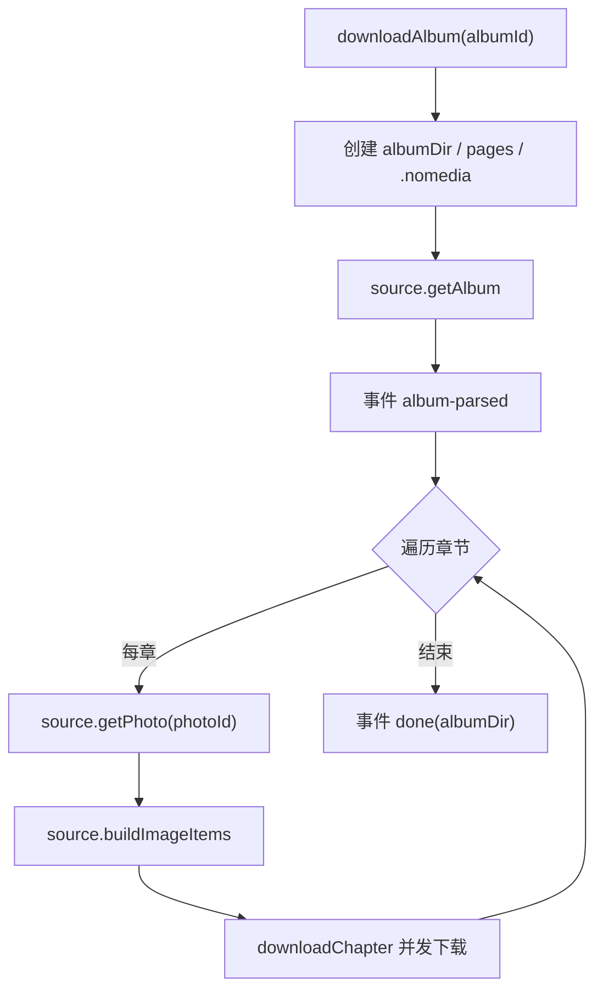

# 下载编排

`src/core/download/` 是链路编排层，通过接口抽象数据来源与运行时能力。

## DownloadService

`downloadAlbum(albumId, onEvent)` 流程（**仅落盘图片**，不再自动合成 PDF）：

- 事件贯穿全程：`album-parsed` → `chapter` → `image` → `done` / `canceled` / `error`（已移除 `pdf-start`）。
- `done` 载荷为 `albumDir`；UI 侧 `saveToLibrary` 据此写入 `pagesDir` / `coverPath` / `pageCount`。
- `scrambleId` 取专辑级值（API 返回 `scramble_id`），章节缺失时回退到专辑值。
- 每张图片写入 `albumDir/pages/`（全局序号，扩展名由 `imageFormat` 决定，默认 `webp`）。
- `albumDir/.nomedia`（空换行文件）阻止系统相册收录封面与页面。

## 解码格式与策略

- `DownloadDeps.imageFormat?: 'webp' | 'jpg'`（设置项 `settings.imageFormat`，默认 webp）。
- `decodeAndSave(..., format?)` 按格式输出；`decideImageStrategy`：
  - `gif` / `num <= 0` → `raw`
  - `num <= 1` 且非 webp → `raw`
  - 其余 → `reassemble`

## 并发控制

`downloadChapter` 使用 `mapWithConcurrency`：

- `calcConcurrency(total, cpuCount, override)`：默认 `min(64, cpuCount * 2, total)`，可配置覆盖。
- 每张图下载后按策略解码 / 重组后写盘。

## 运行时抽象

`DownloadRuntime` 接口（`src/core/download/types.ts`）定义：

- `fs.mkdir / writeFile / readFile / unlink / exists?`
- `decodeAndSave(num, encoded, ext, format?)` → `DecodedImage`
- `createAlbumPdf(...)`（**可选归档能力**，下载主路径不再调用）

三个实现：

| 实现 | 位置 | 能力 |
|---|---|---|
| Capacitor 原生 | `src/core/download/runtime.ts` | Filesystem + Canvas 解码（+ 可选 pdf-lib） |
| Web 内存 | `src/core/download/runtime.ts` | Map 内存文件系统，浏览器调试用 |
| Node 运行时 | `scripts/node-runtime.ts` | Node fs + ImageMagick |

`createRuntime()` 根据 `Capacitor.isNativePlatform()` 选择原生或 Web 实现。

## 图片直读数据流

下载完成后 `pages/` 即主产物，阅读器（`src/web/reader/`）直接渲染：

- 元数据缓存（LRU）：`readdir` 与目录 `getUri` 并行一次完成，全部页面 URI 同步可得。
- 滚动模式：固定槽位高度，窗口当前页 ±1/+8，节点池复用；`image-loader.applyToImg` 直接绑 `src`。
- 横向翻页为三页轨道手势逐页。
- `saveToLibrary` 入库时预加载 `ImageDocMeta`，打开阅读器时命中缓存。
