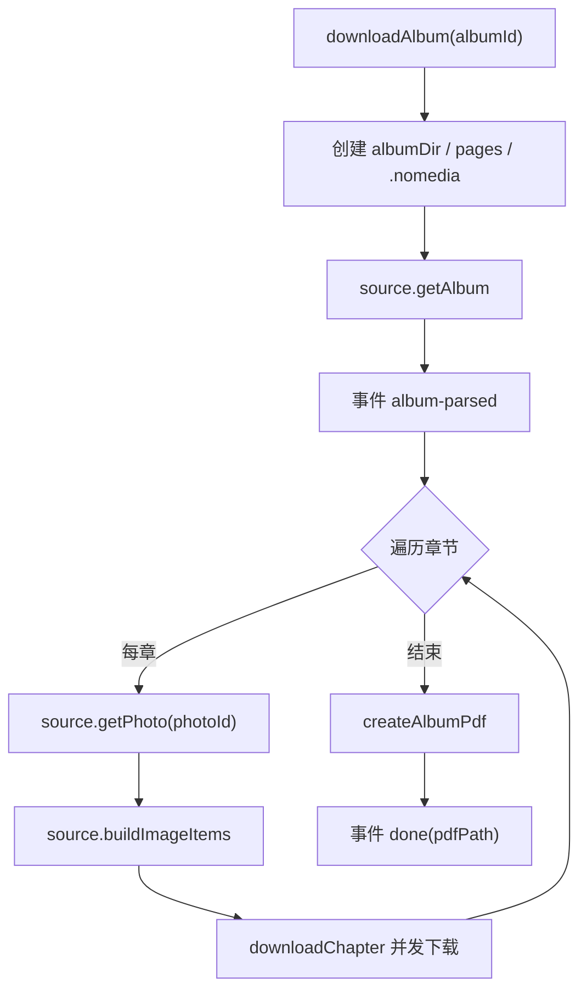

# 下载编排

`src/core/download/` 是链路编排层，通过接口抽象数据来源与运行时能力。

## DownloadService

`downloadAlbum(albumId, onEvent)` 流程：

- 事件贯穿全程：`album-parsed` → `chapter` → `image` → `pdf-start` → `done` / `error`。
- `scrambleId` 取专辑级值（API 返回 `scramble_id`），章节缺失时回退到专辑值。
- 每张图片写入 `albumDir/pages/`（全局序号命名 `0001.jpg` …），PDF 生成后**保留**该序列供阅读器图片直读秒开。
- `albumDir/.nomedia`（空换行文件）阻止系统相册收录封面与页面。

## 并发控制

`downloadChapter` 使用 `mapWithConcurrency`：

- `calcConcurrency(total, cpuCount, override)`：默认 `min(64, cpuCount * 2, total)`，可配置覆盖。
- 每张图下载后按策略解码 / 重组，并记录实际尺寸供 PDF 使用。

## 运行时抽象

`DownloadRuntime` 接口（`src/core/download/types.ts`）定义：

- `fs.mkdir / writeFile / readFile / unlink`
- `decodeAndSave(num, encoded, ext)` → `DecodedImage`
- `createAlbumPdf(outputDir, title, imagePaths, sizes?)`

三个实现：

| 实现 | 位置 | 能力 |
|---|---|---|
| Capacitor 原生 | `src/core/download/runtime.ts` | Filesystem + Canvas 解码 + pdf-lib |
| Web 内存 | `src/core/download/runtime.ts` | Map 内存文件系统，浏览器调试用 |
| Node 运行时 | `scripts/node-runtime.ts` | Node fs + ImageMagick |

`createRuntime()` 根据 `Capacitor.isNativePlatform()` 选择原生或 Web 实现。

## 尺寸传递

重组后每页的实际宽高会随 `sizes` 传给 `createAlbumPdf`，用于统一宽度排版（详见 PDF 生成）。

## 图片直读数据流

PDF 生成后 `pages/` 序列被保留，阅读器（`src/web/reader/`）不再等待 pdf.js 解析：

- 元数据缓存（LRU 3 本）：`readdir` 与目录 `getUri` 并行一次完成，全部页面 URI 同步可得，无逐页 bridge。
- 滚动模式采用命令式窗口化渲染：固定槽位高度，只挂载当前页 ±1/+3，节点 Map 增量增删；解码队列并发 2，优先解码可见页，前方预热 4 页；打开后 `requestIdleCallback` 预热前 12 页（实测可消首次滑动卡顿）。
- 横向翻页为三页轨道手势逐页，松手最多进一页。
- `saveToLibrary` 入库时预加载 `ImageDocMeta`，打开阅读器时命中缓存。
- **实测（1214052，243 页，均约 792KB/页）**：桌面 `bench-reader-flow` 显示瓶颈在解码（p50≈33ms/页@400px），读盘可忽略；`prewarm12 + ±1/+3 + 并发2` 为首选（`firstScroll≈0`，滚完全部约 7.8s）。
