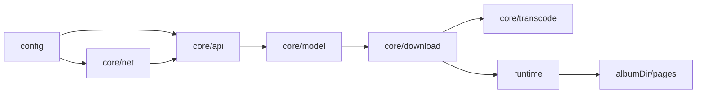
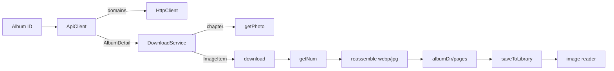

# 架构总览

JMFM 采用前后端分离的分层结构：`src/config` 提供集中配置，`src/core` 承载全部业务逻辑，`src/web` 为 Capacitor 壳内的 React Web UI 层。

## 目录结构

```
src/
  config/                 # 集中配置（app-config.json + 类型加载器）
    app-config.json
    index.ts
  core/                   # 业务核心，不依赖 UI
    api/                  # API 通道（client 请求鉴权重试 + parse 纯解析 + 域名全局共享）
    constants/            # 常量（算法阈值、请求参数）
    crypto/               # MD5 / AES-256-ECB
    model/                # 领域模型（Album / Photo / ImageItem / blocklist / 扩展名集合）
    net/                  # HttpClient 接口 + Fetch / Capacitor 原生实现 + 统一重试
    fs/                   # 文件系统接口抽象（原子写入、SAF 适配）
    transcode/            # 条带计算 + 图片重组
    download/             # 下载编排（pages 共享下载 + scheduler 并发/内存控制 + Runtime 抽象）
    update/               # 应用内更新（版本检查、APK 流式下载 + SHA-256 校验）
    util/                 # UTF-8 / Base64 / SHA-256 / 文件名清洗 等工具
  data/                   # 统一持久化（user-storage：Preferences / localStorage；storage-keys 常量）
  web/                    # UI 层（React DOM + CSS，运行于 Capacitor 壳）
    assets/               # 图标（Iconify SVG）与字体（woff2）
    components/           # 展示组件
    download/             # 下载运行时装配 / SAF 运行时 / 任务清理
    hooks/                # 下载 / 封面 / 键盘 / 手势 / 修复等 hooks
    library/              # 入库 / 封面 / 封面缓存 / 路径解析 / 增量修复 / 每日推荐 / 缓存 / dismissed
    reader/               # 图片直读（image-doc / image-loader / image-reader / pdf-doc）
    screens/              # 5 个页面（Home / Library / Tasks / Settings / Reader）
    stores/               # zustand 状态库
    styles/               # CSS 样式模块
    theme/                # Cirrus 设计 token（CSS 变量）
    generated/            # icons.ts（由 SVG 生成）
    App.tsx / main.tsx / index.html
__tests__/                # 单元测试（20 文件 / 149 用例）；helpers/ 存放测试专用代码
scripts/
  verify-download.ts      # Node 端完整下载链路验证脚本
  node-runtime.ts         # Node 运行时（ImageMagick 解码）
  bench-reader-flow.ts    # 阅读器滚动窗口桌面基准
  shared/axios-http.ts    # 仅脚本用的 axios 客户端
capacitor.config.ts       # Capacitor 配置（appId / webDir / 插件）
android/                  # Capacitor 生成的 Android 原生工程
```

## 分层依赖



- **net / api / model**：数据获取与建模。
- **transcode**：图片解密重组的纯算法。
- **download**：编排层，依赖 `DownloadRuntime` 接口而非具体实现；主路径只写 `pages/`。
- **runtime**：Capacitor 原生（Filesystem + Canvas）、SAF、Web 内存版与 Node（ImageMagick）实现同一接口。

## 完整数据流



## 设计要点

- **接口隔离**：`ContentSource` 取数，`DownloadRuntime` 抽象落盘与解码；core 不依赖 UI。
- **纯函数**：`getNum`、`computeStrips` 可单测。
- **配置驱动**：域名、密钥、请求头、并发、超时来自 `app-config.json`。
- **HttpClient 可插拔**：Web 用 `FetchHttpClient`；真机用 `NativeHttpClient`（绕过 CORS，含 fetch 回退），按 `Capacitor.isNativePlatform()` 选择；axios 仅 Node 脚本（`scripts/shared/axios-http.ts`）。
- **重试收敛**：`core/net/retry.ts` 的 `requestWithRetry` 统一域名轮换 × 重试双循环，`retryable` 区分 4xx/5xx；`fetchOnce` 内置 `AbortSignal.timeout` 超时。
- **域名协议**：每个域名先 `https://`，再回退 `http://`；`refreshDomains` 结果全局共享，最多探测一次。
- **pages 主路径**：下载只写 `pages/`（默认 webp），原子写入（`.tmp` + rename）防半文件；阅读器渲染本地图片；旧 PDF 走 pdf.js 回退。
- **串行队列**：`src/web/download/queue.ts`，`MAX_CONCURRENT = 1`；暂停/失败切下一本。
- **下载内存控制**：`download/scheduler.ts` 提供 `MemoryGate` 字节水位与 `Semaphore` 解码限流。
- **封面预加载**：`coverCache` 在启动与库变更时预解码封面 URI，减少 Tab 切换布局跳动；首屏仅前 8 张，其余懒加载。
- **统一持久化**：`data/user-storage.ts` 抽象 Preferences（原生）/ localStorage（Web），键名集中 `storage-keys.ts`。
- **修复文件**：设置页扫描并补齐缺失页面、封面与元数据，路径变更自动重定位。
- **每日推荐**：白名单优先 → 偏爱标签 → 按时间梯度补齐（今天更新优先、不足按时间往前推进）；按日缓存，支持 dismiss。
- **应用内更新**：APK 流式分块下载 + 增量 SHA-256 校验，避免整包驻留内存。
