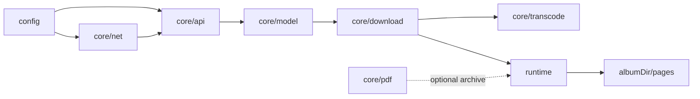
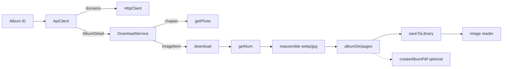

# 架构总览

JMFM 采用前后端分离的分层结构：`src/config` 提供集中配置，`src/core` 承载全部业务逻辑，`src/web` 为 Capacitor 壳内的 React Web UI 层。

## 目录结构

```
src/
  config/                 # 集中配置（app-config.json + 类型加载器）
    app-config.json
    index.ts
  core/                   # 业务核心，不依赖 UI
    api/                  # API 通道（client 请求鉴权重试 + parse 纯解析）
    constants/            # 常量（算法阈值、请求参数、PDF 尺寸）
    crypto/               # MD5 / AES-256-ECB
    model/                # 领域模型（Album / Photo / ImageItem / blocklist）
    net/                  # HttpClient 接口 + Fetch / Capacitor 原生实现 + 重试
    fs/                   # 文件系统接口抽象
    pdf/                  # PDF 页面布局（统一宽度、尺寸计算）
    transcode/            # 条带计算 + 图片重组
    download/             # 下载编排（DownloadService + Runtime 抽象）
    util/                 # UTF-8 / Base64 等工具
  data/                   # 设置持久化（storage 接口）
  web/                    # UI 层（React DOM + CSS，运行于 Capacitor 壳）
    assets/               # 图标（Iconify SVG）与字体
    components/           # 展示组件
    download/             # 下载串行队列
    hooks/                # 下载 / 封面 / 键盘 / 手势 / 资源修复等 hooks
    library/              # 入库 / 封面缓存 / 每日推荐 / uid 工具
    reader/               # 图片直读（image-doc / image-loader / image-reader / pdf-doc）
    screens/              # 5 个页面（Home / Library / Tasks / Settings / Reader）
    stores/               # zustand 状态库
    styles/               # CSS 样式模块
    theme/                # Cirrus 设计 token（CSS 变量）
    generated/            # icons.ts（由 SVG 生成）
    App.tsx / main.tsx / index.html
__tests__/                # 单元测试；helpers/ 存放测试专用代码
scripts/
  verify-download.ts      # Node 端完整链路验证脚本
  node-runtime.ts         # Node 运行时（ImageMagick 解码 + PDF）
  shared/axios-http.ts    # 仅脚本用的 axios 客户端
capacitor.config.ts       # Capacitor 配置（appId / webDir / 插件）
android/                  # Capacitor 生成的 Android 原生工程
```

## 分层依赖



- **net / api / model**：数据获取与建模。
- **transcode**：图片解密重组的纯算法。
- **download**：编排层，依赖 `DownloadRuntime` 接口而非具体实现；主路径只写 `pages/`。
- **runtime**：Capacitor 原生（Filesystem + Canvas）、Web 内存版与 Node（ImageMagick）实现同一接口；`createAlbumPdf` 仍保留供可选归档。

## 完整数据流



## 设计要点

- **接口隔离**：`ContentSource` 取数，`DownloadRuntime` 抽象落盘与解码；core 不依赖 UI。
- **纯函数**：`getNum`、`computeStrips`、`computeUniformWidth`、`scaleSize` 可单测。
- **配置驱动**：域名、密钥、请求头、PDF 参数来自 `app-config.json`。
- **HttpClient 可插拔**：Web 用 `FetchHttpClient`；真机用 `NativeHttpClient`（绕过 CORS，含 fetch 回退），按 `Capacitor.isNativePlatform()` 选择；axios 仅 Node 脚本（`scripts/shared/axios-http.ts`）。
- **重试收敛**：`core/net/retry.ts` 的 `requestWithRetry` 统一域名轮换 × 重试双循环，Fetch 与原生实现共用。
- **pages 主路径**：下载只写 `pages/`（默认 webp）；阅读器渲染本地图片；PDF 可选，旧 PDF 走 pdf.js。
- **串行队列**：`src/web/download/queue.ts`，`MAX_CONCURRENT = 1`；暂停/失败切下一本。
- **封面预加载**：`coverCache` 在启动与库变更时预解码封面 URI，减少 Tab 切换布局跳动。
- **资源修复**：设置页三检（元数据 / 格式+页数 / 封面），不合格删目录并重入队列。
- **每日推荐**：`web/library/daily.ts` 按偏爱标签优先 + 随机补齐；`web/stores/daily.ts` 按日缓存，自动过期。
