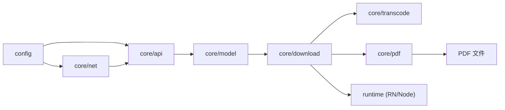
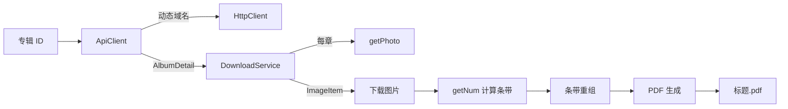

# 架构总览

JMFM 采用前后端分离的分层结构：`src/config` 提供集中配置，`src/core` 承载全部业务逻辑，`src/app` 为后续 UI 层占位。

## 目录结构

```
src/
  config/                 # 集中配置（app-config.json + 类型加载器）
    app-config.json
    index.ts
  core/                   # 业务核心，不依赖 UI
    api/                  # API 通道（域名刷新、token、解密、图片 URL）
    constants/            # 常量（算法阈值、请求参数、PDF 尺寸）
    crypto/               # MD5 / AES-256-ECB
    model/                # 领域模型（Album / Photo / ImageItem）
    net/                  # HttpClient（域名轮换、重试、代理）
    parser/               # HTML 解析 + Base64（备用通道）
    pdf/                  # PDF 页面布局（统一宽度、尺寸计算）
    transcode/            # 条带计算 + 图片重组
    download/             # 下载编排（DownloadService + Runtime 抽象）
    util/                 # UTF-8 解码等工具
  app/                    # UI 层（占位，后续单独设计）
scripts/
  verify-download.ts      # Node 端完整链路验证脚本
  node-runtime.ts         # Node 运行时（ImageMagick 解码 + PDF）
```

## 分层依赖



- **net / api / model**：数据获取与建模。
- **transcode**：图片解密重组的纯算法。
- **download**：编排层，依赖 `DownloadRuntime` 接口而非具体实现。
- **runtime**：RN 运行时（Skia + images-to-pdf）与 Node 运行时（ImageMagick）实现同一接口，可无缝切换。

## 完整数据流



## 设计要点

- **接口隔离**：`ContentSource` 抽象数据来源，`DownloadRuntime` 抽象运行时能力，业务层不感知 UI 与具体运行时。
- **纯函数优先**：`getNum`、`computeStrips`、`computeUniformWidth`、`scaleSize` 均为纯函数，可直接单测。
- **配置驱动**：域名、密钥、请求头、PDF 参数全部读自 `app-config.json`。
