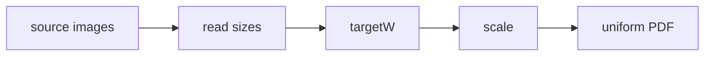

# PDF 生成

`src/core/pdf/` 负责将还原后的图片组装为阅读体验统一的 PDF。

> 定位：PDF 为**可选归档能力**（`DownloadRuntime.createAlbumPdf`）。下载主路径**不再自动合成 PDF**，只落 `albumDir/pages/`；阅读器以图片直读为主；仅旧 PDF（无 `pages/`）用 pdf.js 回退。

## 统一宽度

原始图片宽度可能各不相同。目标宽度动态取值：

```typescript
// src/core/pdf/layout.ts
export function computeUniformWidth(widths: number[], maxWidth: number): number {
  return Math.min(Math.max(...widths), maxWidth);
}
```

- 取全部源图的最大宽度，保证最大图不被放大（只缩小不放大）。
- 超过配置上限 `PDF.MAX_WIDTH`（默认 1190）时封顶，避免超大图。
- 各页面按目标宽度等比例缩放，页面尺寸即缩放后的图片尺寸，不补白色背景。



## 尺寸计算

`scaleSize(width, height, targetWidth)` 等比缩放，返回取整后的宽高。

## 页面构建

`buildPdfPages(imagePaths, sizes?)`（`src/core/pdf/index.ts`）：

- 有尺寸信息时：按 `computeUniformWidth` + `scaleSize` 生成每页实际宽高，`imageFit: 'fill'`。
- 无尺寸信息时：回退固定 A4 + `contain`，保证可用性。

## pdf-lib 渲染

`buildPdfBytes(pages, readImage)` 用 `pdf-lib` 生成二进制：

1. `PDFDocument.create()` 创建文档。
2. 对每页 `embedPng` / `embedJpg`（按扩展名判断）。
3. `addPage([width, height])` 后 `drawImage` 铺满整页，无白边。

Capacitor 原生运行时通过 `fs.readFile` 读取临时图片字节后交给 `buildPdfBytes`。

## Node 运行时（ImageMagick）

`scripts/node-runtime.ts` 的 `createPdfWithMagick`：

1. 先 `identify` 全部图片宽度。
2. `computeUniformWidth` 计算目标宽度。
3. `magick imgs... +repage -resize {W}x output.pdf` 拼装。

> `+repage` 必须在 `-resize` 前，清除条带裁剪遗留的虚拟页面元数据，否则 MediaBox 错误、出现小图与白色占位。

## 文件命名

`buildFileName(title)`：使用漫画标题命名，替换非法字符、截断 `TITLE_MAX_LEN`（200）。

```text
[五月雨汉化组]实际上只是、想在一起.pdf
```

## 配置项

`src/config/app-config.json` 的 `pdf` 段：页面宽高、最大宽度、最大高度、标题长度上限、背景色。
