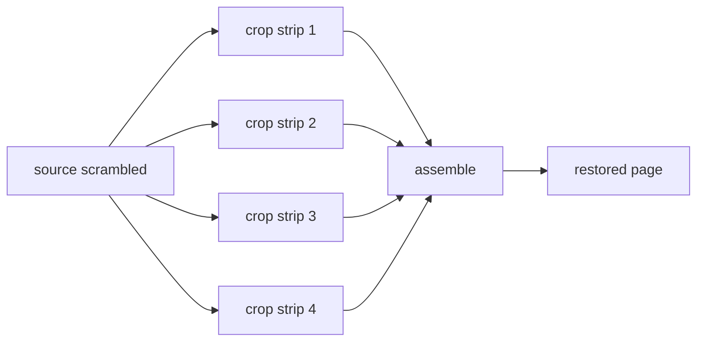

# 图片解密与重组

漫画图片被按条带分割并打乱顺序。`src/core/transcode/` 负责计算条带并重排还原。

## 条带数量计算

`getNum(scrambleId, aid, fileName)`（`src/core/transcode/index.ts`）：

```typescript
if (aid < scrambleId) return 0;              // 未加密
if (aid < SCRAMBLE_268850) return 10;        // 老专辑固定 10
const x = aid < SCRAMBLE_421926 ? 10 : 8;    // 中间档 10，新专辑 8
const s = md5Hex(`${aid}${fileName}`);
return s.charCodeAt(s.length - 1) % x * 2 + 2; // 2,4,6,...,20
```

返回 0 表示图片未拆分，直接使用；返回 n 表示图片被拆成 n 条带。

## 条带位置计算

`computeStrips(num, height)` 计算每个条带在源图中的裁剪区域与目标位置：

- 按条带数均匀分割图片高度。
- 第一个条带吸收余数。
- 条带在源图中自下而上读取，在目标中自上而下放置，即**逆序重排**。

```typescript
export function computeStrips(num: number, height: number): Strip[] {
  const over = height % num;
  const base = Math.floor(height / num);
  // ...
  // 每个 strip: {ySrc（源图裁剪起点）, yDst（目标放置起点）, height}
}
```

## 重组流程

以 n=4、高度 1371 为例：



## 运行时实现

`decodeAndSave(num, encoded, ext)` 两个运行时实现：

- **Capacitor / Web（Canvas）**：`src/core/transcode/decode.ts` 用 `createImageBitmap` 解码，`canvas.drawImage` 按条带目标位置绘制，`toBlob('image/png')` 输出。
- **Node（ImageMagick）**：`scripts/node-runtime.ts` 用 `-crop` 裁剪条带、`-append +repage` 拼接。

> 关键细节：ImageMagick 裁剪后需 `+repage` 重置虚拟页面，否则转 PDF 时页面尺寸错误，出现小图 + 白色占位。

## 格式策略

`decideImageStrategy(num, ext)`：

- `gif` 或 `num <= 0`：`raw`，原样保存。
- 其余：`reassemble`，走重组流程。
