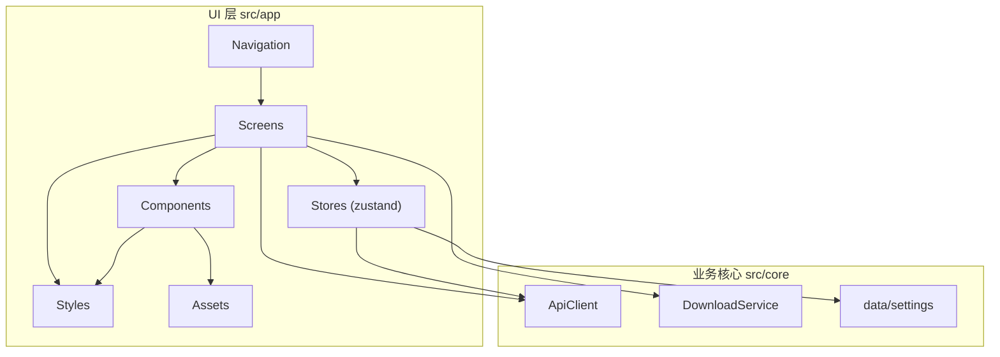
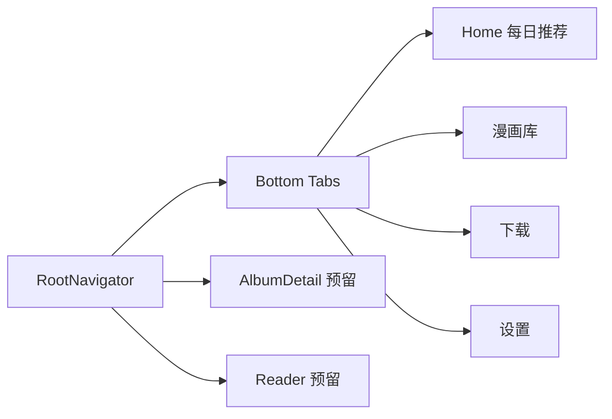

# UI 架构

JMFM 的 UI 层位于 `src/app`，与业务核心 `src/core` 完全分离。UI 层仅通过 `ApiClient`、`DownloadService`、`Settings` 三个入口消费业务能力，不直接触碰网络、加解密与文件逻辑。

## 分层框架



- **Navigation**：`@react-navigation` 组织路由，bottom-tabs 承载 4 个主页面，native-stack 承载详情/阅读等二级页面。
- **Screens**：页面级组件，只负责组合与事件分发，无业务实现。
- **Stores**：zustand 状态库，页面通过 store 读写 UI 状态，并桥接 `core` 的服务。
- **Components**：无业务语义的展示组件。
- **Styles**：全部样式以独立模块置于 `src/app/styles/`，tsx 内不写 `StyleSheet`。
- **Assets**：图标（Iconify SVG）与字体（Alimama / BebasNeue）统一存放。

## 导航结构



### 路由表

| 名称 | 组件 | 说明 |
| --- | --- | --- |
| `Home` | `HomeScreen` | 每日推荐列表 |
| `Library` | `LibraryScreen` | 本地漫画库 + 搜索 |
| `Tasks` | `TasksScreen` | 下载任务与进度 |
| `Settings` | `SettingsScreen` | 应用设置 |
| `AlbumDetail` | 预留 | 专辑详情（后续接入） |
| `Reader` | 预留 | 阅读器（后续接入） |

## 页面职责

- **Home**：展示每日推荐卡片（封面、标题、作者、标签、章节数），点击进入详情。当前以 mock 数据驱动，后续接入推荐 API。
- **Library**：展示已下载漫画，支持搜索与排序。
- **Tasks**：展示下载队列与实时进度，支持暂停/恢复/删除。
- **Settings**：下载路径、重试次数、并发线程、图片格式、代理等，读写 `data/settings`。

## 状态管理

| Store | 职责 |
| --- | --- |
| `useSettingsStore` | 包装 `data/settings` 的读取与持久化 |
| `useDownloadStore` | 下载任务集合与进度（pending / downloading / paused / done） |
| `useLibraryStore` | 本地已下载漫画，AsyncStorage 持久化 |
| `useHistoryStore` | 浏览历史（预留） |

## 样式体系

基于 `src/app/theme/index.ts` 的 Cirrus 设计 token（`colors` / `radii` / `shadow` / `typography` / `spacing` / `easing`）。

- 页面与组件样式分别置于 `src/app/styles/` 下对应文件，tsx 不内联样式。
- 主题色：`ink` 主文本、`signal` 主操作、`citrus` 强调、`meadow` 成功、`lightFill` 填充、`edge` 分隔线。

## 资产规范

### 图标

- 来源：[Iconify Material Symbols](https://icon-sets.iconify.design/material-symbols/)，仅存 SVG 矢量文件到 `src/app/assets/icons/`。
- 组件 `Icon` 通过 `react-native-svg` 的 `SvgXml` 渲染，图标使用 `currentColor`，着色由外层传入 `color` 控制。
- Tab 图标：`home`、`auto-stories`、`download`、`settings`。

### 字体

| 文件 | fontFamily | 用途 |
| --- | --- | --- |
| `AlimamaShuHeiTi-Bold.ttf` | `AlimamaShuHeiTi-Bold` | 中文标题、品牌字 |
| `BebasNeue-Regular.ttf` | `BebasNeue-Regular` | 英文与数字、装饰字 |

- 字体源文件存放 `src/app/assets/fonts/`。
- Android 已注册到 `android/app/src/main/assets/fonts/`（自动加载）。
- iOS 工程已就位，字体文件置于 `ios/JMFMobile/Fonts/`，`Info.plist` 注册后续补充（当前阶段仅开发 Android）。

## 目录结构

```
src/app/
  assets/
    fonts/                # Alimama / BebasNeue
    icons/                # Iconify SVG
  components/             # Icon / AlbumCard / SearchBar / ...
  navigation/             # RootNavigator
  screens/                # Home / Library / Tasks / Settings
  stores/                 # zustand stores
  styles/                 # 样式模块
  theme/                  # Cirrus tokens
  App.tsx
```
