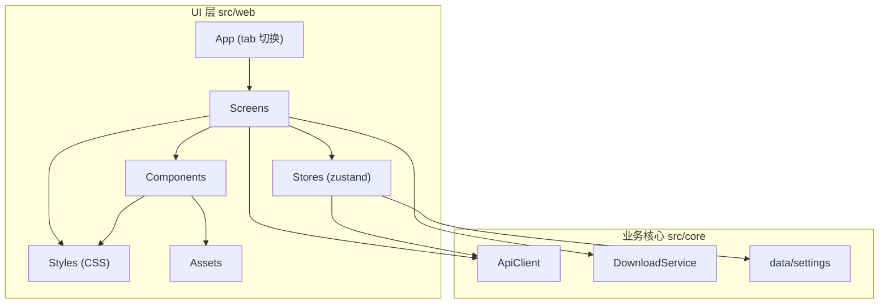
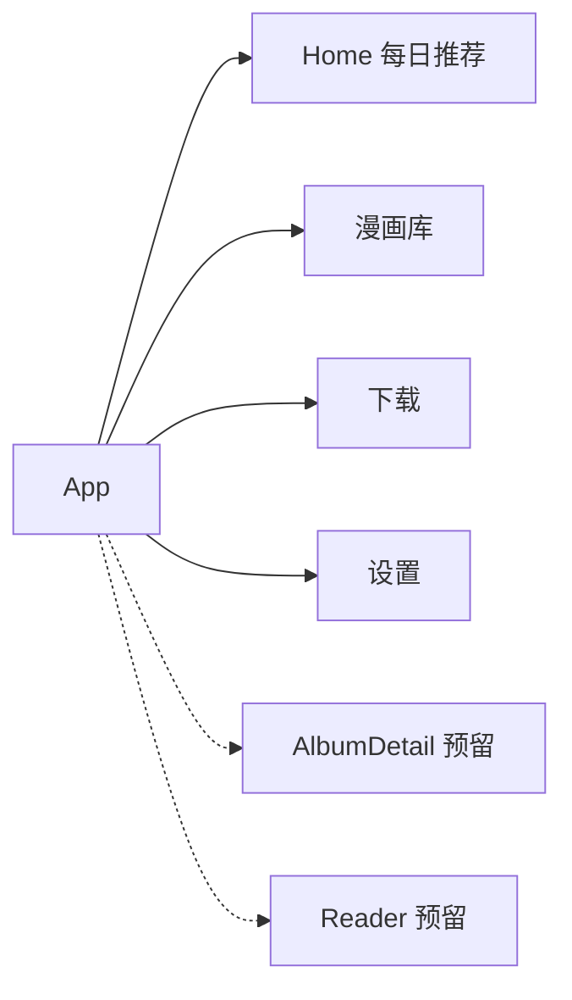

# UI 架构

JMFM 的 UI 层位于 `src/web`（React DOM + CSS），运行在 Capacitor 壳的 WebView 内，与业务核心 `src/core` 完全分离。UI 层仅通过 `ApiClient`、`DownloadService`、`Settings` 三个入口消费业务能力，不直接触碰网络、加解密与文件逻辑。

## 分层框架



- **App**：轻量 state tab 切换，承载 4 个主页面（无路由库）。
- **Screens**：页面级组件，只负责组合与事件分发，无业务实现。
- **Stores**：zustand 状态库，页面通过 store 读写 UI 状态，并桥接 `core` 的服务。
- **Components**：无业务语义的展示组件。
- **Styles**：全部样式为独立 CSS 文件，置于 `src/web/styles/`，tsx 内不写内联样式表。
- **Assets**：图标（Iconify SVG）与字体（Alimama / BebasNeue）统一存放。

## 导航结构



### 页面表

| 名称 | 组件 | 说明 |
| --- | --- | --- |
| `Home` | `HomeScreen` | 每日推荐列表 |
| `Library` | `LibraryScreen` | 本地漫画库 + 搜索 |
| `Tasks` | `TasksScreen` | 下载任务与进度 |
| `Settings` | `SettingsScreen` | 应用设置 |
| `AlbumDetail` | 预留 | 专辑详情（后续接入） |
| `Reader` | 预留 | 阅读器（后续接入） |

## 页面职责

- **Home**：展示每日推荐卡片（封面、标题、作者、标签、章节数），点击进入详情。当前以 mock 数据驱动，后续接入推荐 API。
- **Library**：展示已下载漫画，支持搜索与排序。
- **Tasks**：展示下载队列与实时进度，支持暂停/恢复/删除。
- **Settings**：下载路径、重试次数、并发线程、图片格式、代理等，读写 `data/settings`。

## 状态管理

| Store | 职责 |
| --- | --- |
| `useSettingsStore` | 包装 `data/settings` 的读取与持久化（Capacitor Preferences / localStorage） |
| `useDownloadStore` | 下载任务集合与进度（pending / running / done / error） |
| `useLibraryStore` | 本地已下载漫画（预留） |

## 样式体系

基于 `src/web/theme/index.css` 的 Cirrus 设计 token（CSS 变量：surface / ink / accent / radii / shadow / spacing / typography / easing）。

- 页面与组件样式分别置于 `src/web/styles/` 下对应 CSS 文件，tsx 不内联样式。
- 主题色：`ink` 主文本、`accent-primary` 主操作、`accent-success` 成功、`accent-danger` 危险、`surface` 表面、`shadow-1/2` 双层阴影、`ease-spring` 弹性动效。

## 资产规范

### 图标

- 来源：[Iconify Material Symbols](https://icon-sets.iconify.design/material-symbols/)，仅存 SVG 矢量文件到 `src/web/assets/icons/`。
- `scripts/gen-icons.ts` 生成 `src/web/generated/icons.ts`（SVG 字符串映射）。
- 组件 `Icon` 用 `dangerouslySetInnerHTML` 内联渲染 `<svg>`，图标使用 `currentColor`，颜色由外层 CSS 控制。
- Tab 图标：`home`、`auto-stories`、`download`、`settings`。

### 字体

| 文件 | fontFamily | 用途 |
| --- | --- | --- |
| `AlimamaShuHeiTi-Bold.woff2/.ttf` | `Alimama ShuHeiTi` | 中文标题、品牌字 |
| `BebasNeue.woff2` | `Bebas Neue` | 英文与数字、装饰字 |

- 字体源文件存放 `src/web/assets/fonts/`。
- `src/web/styles/fonts.css` 通过 `@font-face` 注册，Bun build 自动打包（小体积字体内联为 data URI）。

## 目录结构

```
src/web/
  assets/
    fonts/                # Alimama / BebasNeue
    icons/                # Iconify SVG
  components/             # Icon / AlbumCard / SearchBar / ...
  generated/              # icons.ts（脚本生成）
  screens/                # Home / Library / Tasks / Settings
  stores/                 # zustand stores
  styles/                 # CSS 样式模块
  theme/                  # Cirrus tokens（CSS 变量）
  App.tsx                 # tab 切换
  main.tsx                # ReactDOM.createRoot 入口
  index.html              # WebView 宿主页
```

## 构建与运行

```bash
bun run build            # bun build → dist/
bunx cap sync android    # 同步 web 产物到原生工程
bunx cap run android     # 构建并运行到已连接设备
bash scripts/dev-android.sh   # 一键：build → sync → 真机优先运行
```
