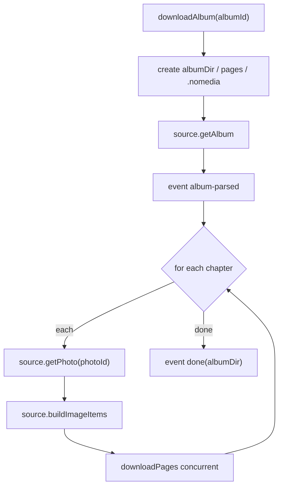

# Download Orchestration

`src/core/download/` is the orchestration layer, abstracting data sources and runtime capabilities behind interfaces.

## DownloadService

`downloadAlbum(albumId, onEvent)` flow (**pages only** — no automatic PDF merge):

- Events: `album-parsed` → `chapter` → `image` → `done` / `canceled` / `error` (`pdf-start` removed).
- `done` carries `albumDir`; the UI `saveToLibrary` writes `pagesDir` / `coverPath` / `pageCount` from it.
- `scrambleId` takes the album-level value (API `scramble_id`); chapters fall back to the album value when missing.
- Each image is written under `albumDir/pages/` (global numbering; extension from `imageFormat`, default `webp`).
- `albumDir/.nomedia` keeps the system gallery from indexing covers and pages.

## Shared page download (src/core/download/pages.ts)

`DownloadService` and the "repair files" flow share one page engine:

- `collectAlbumPages(source, albumId)`: expands every chapter into an ordered `ImageItem[]`.
- `downloadPages(ctx, items, pagesDir, offset, controller?, onProgress?, opts?)`:
  - Concurrent download (`calcConcurrency`), skipping files that already exist — resume / backfill for free.
  - `opts.preferredExt` forces a target format: mismatched files are deleted and re-fetched (format repair).
  - Each page goes through `decideImageStrategy`: `raw` write or `decodeAndSave` reassembly.
- `fetchImageBytes` / `findExisting`: per-page fetch (3 retries) and multi-extension probing.
- Cancellation: setting `controller.paused` throws `CanceledError`; detected via `isCanceledError`.

## Decode format & strategy

- `DownloadDeps.imageFormat?: 'webp' | 'jpg'` (from `settings.imageFormat`, default webp).
- `decodeAndSave(..., format?)` encodes accordingly; `decideImageStrategy`:
  - `gif` / `num <= 0` → `raw`
  - `num <= 1` and not webp → `raw`
  - otherwise → `reassemble`

## Concurrency Control

`downloadPages` uses `mapWithConcurrency`:

- `calcConcurrency(total, cpuCount, override)`: defaults to `min(64, cpuCount * 2, total)`, with an override option.
- After each download, decode / reassemble by strategy, then write to disk.

## Runtime Abstraction

The `DownloadRuntime` interface (`src/core/download/types.ts`) defines:

- `fs.mkdir / writeFile / readFile / unlink / exists?`
- `decodeAndSave(num, encoded, ext, format?)` → `DecodedImage`
- `createAlbumPdf(...)` (**optional archive**; not called on the download hot path)

Three implementations:

| Implementation | Location | Capability |
|---|---|---|
| Capacitor native | `src/core/download/runtime.ts` | Filesystem + Canvas decode (+ optional pdf-lib) |
| Web in-memory | `src/core/download/runtime.ts` | Map-backed filesystem, for browser debugging |
| Node runtime | `scripts/node-runtime.ts` | Node fs + ImageMagick |

`createRuntime()` picks native or web via `Capacitor.isNativePlatform()`.

## Direct image reading flow

After download, `pages/` is the primary artifact; the reader (`src/web/reader/`) renders it directly:

- Metadata cache (LRU): one parallel `readdir` + directory `getUri`; every page URI is available synchronously.
- Scroll mode: fixed slot heights, window current ±1/+8, node pool reuse; `image-loader.applyToImg` binds `src` directly.
- Paged mode: three-slide track with one-page gesture flips.
- `saveToLibrary` preloads `ImageDocMeta` on insert so opening from the library hits the cache.

## Repair files

Settings → Repair files: scan the library and backfill missing pages, covers, and metadata. Full re-download only when an album is entirely missing.

| Case | Action |
|---|---|
| Path changed | Remap to the current download directory |
| Missing / wrong-format pages | Download only what's missing |
| Missing cover | Re-download cover |
| Missing metadata | Refresh title, author, tags |
| Album gone | Queue for download |
