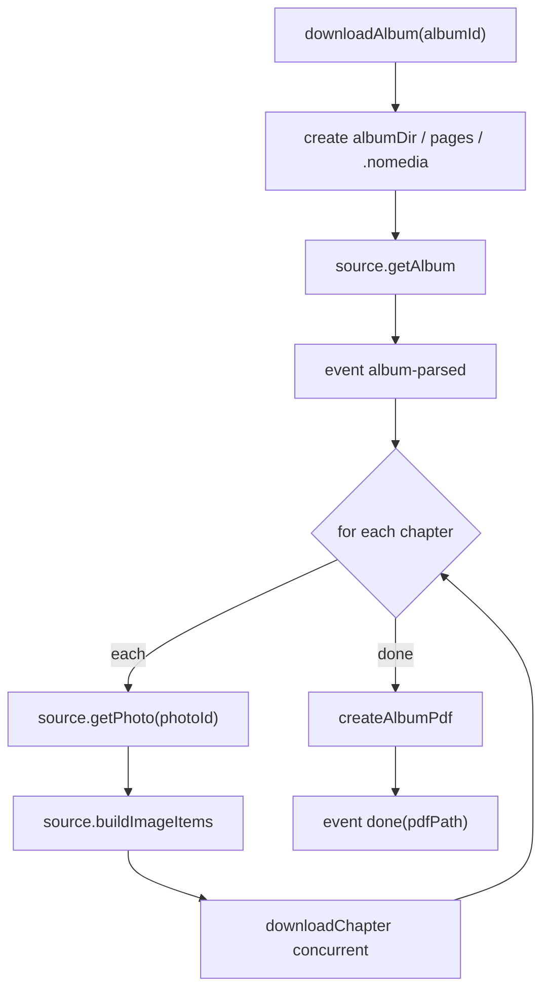
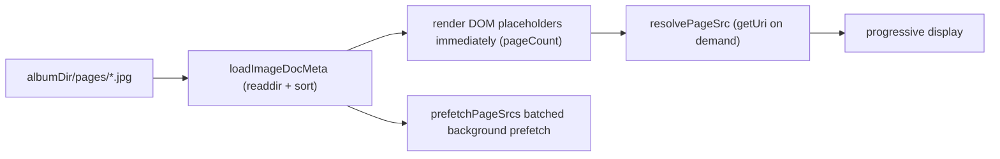

# Download Orchestration

`src/core/download/` is the orchestration layer, abstracting data sources and runtime capabilities behind interfaces.

## DownloadService

`downloadAlbum(albumId, onEvent)` flow:

- Events run through the whole flow: `album-parsed` → `chapter` → `image` → `pdf-start` → `done` / `error`.
- `scrambleId` takes the album-level value (the API returns `scramble_id`); when a chapter is missing it, it falls back to the album value.
- Each image is written to `albumDir/pages/` (globally numbered `0001.jpg` …). The sequence is **kept** after PDF generation so the reader can show images instantly without pdf.js.
- `albumDir/.nomedia` (an empty newline file) keeps the system photo gallery from indexing covers and pages.

## Concurrency Control

`downloadChapter` uses `mapWithConcurrency`:

- `calcConcurrency(total, cpuCount, override)`: defaults to `min(64, cpuCount * 2, total)`, with an override option.
- After each image is downloaded, it is decoded / reassembled by strategy, and the actual size is recorded for PDF layout.

## Runtime Abstraction

The `DownloadRuntime` interface (`src/core/download/types.ts`) defines:

- `fs.mkdir / writeFile / readFile / unlink`
- `decodeAndSave(num, encoded, ext)` → `DecodedImage`
- `createAlbumPdf(outputDir, title, imagePaths, sizes?)`

Three implementations:

| Implementation | Location | Capability |
|---|---|---|
| Capacitor native | `src/core/download/runtime.ts` | Filesystem + Canvas decode + pdf-lib |
| Web in-memory | `src/core/download/runtime.ts` | Map-backed filesystem, for browser debugging |
| Node runtime | `scripts/node-runtime.ts` | Node fs + ImageMagick |

`createRuntime()` picks native or web implementation via `Capacitor.isNativePlatform()`.

## Size Propagation

The actual width and height of each reassembled page are passed to `createAlbumPdf` via `sizes` for uniform-width layout (see PDF Generation).

## Direct image reading flow

After PDF generation the `pages/` sequence is kept, so the reader (`src/web/reader/`) does not wait for pdf.js parsing:

- Metadata is cached (LRU 3 albums) and srcs fill lazily: `readdir` first for page count and names without blocking the first frame; near-visible pages resolve `getUri` on demand, while a background batch prefetch (`PREFETCH_BATCH = 6`) avoids a bridge storm.
- Scroll mode uses windowed rendering: only the current page ±3/+6 stays mounted, with spacers sized by each page's aspect ratio carrying the total height; pages leaving the window unmount (mirroring the native RecyclerView reuse model). `onScroll` locates the current page via rAF throttling plus pure arithmetic binary search.
- `saveToLibrary` pre-warms the first 6 pages on insert, so the first screen shows immediately when opening from the library.
