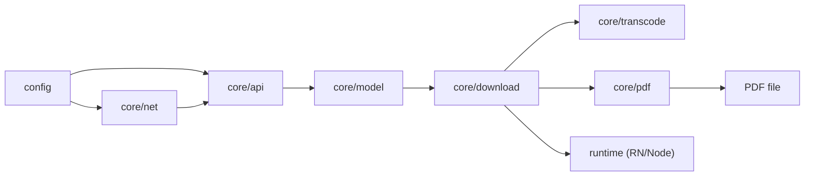
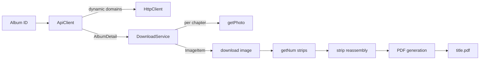

# Architecture Overview

JMFM follows a frontend/backend split: `src/config` holds centralized configuration, `src/core` carries all business logic, and `src/app` reserves the future UI layer.

## Directory Layout

```
src/
  config/                 # Centralized config (app-config.json + typed loader)
    app-config.json
    index.ts
  core/                   # Business core, UI-free
    api/                  # API channel (domains, token, decryption, image URLs)
    constants/            # Constants (algorithm thresholds, request params, PDF sizes)
    crypto/               # MD5 / AES-256-ECB
    model/                # Domain models (Album / Photo / ImageItem)
    net/                  # HttpClient (rotation, retry, proxy)
    parser/               # HTML parsing + Base64 (fallback channel)
    pdf/                  # PDF layout (uniform width, size calculation)
    transcode/            # Strip calculation + image reassembly
    download/             # Download orchestration (DownloadService + Runtime abstraction)
    util/                 # UTF-8 decode and other utilities
  app/                    # UI layer (placeholder, designed separately)
scripts/
  verify-download.ts      # Node-side full pipeline verification
  node-runtime.ts         # Node runtime (ImageMagick decode + PDF)
```

## Layer Dependencies



- **net / api / model**: data fetching and modeling.
- **transcode**: pure algorithms for image restoration.
- **download**: orchestration depending on the `DownloadRuntime` interface, never on a concrete implementation.
- **runtime**: RN (Skia + images-to-pdf) and Node (ImageMagick) implement the same interface, so switching is seamless.

## Full Data Flow



## Design Principles

- **Interface isolation**: `ContentSource` abstracts the data source; `DownloadRuntime` abstracts runtime capabilities. Business logic never touches UI or a specific runtime.
- **Pure functions first**: `getNum`, `computeStrips`, `computeUniformWidth`, `scaleSize` are pure and directly unit-testable.
- **Config-driven**: domains, secrets, request headers and PDF params all come from `app-config.json`.
