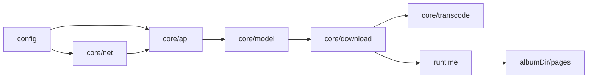
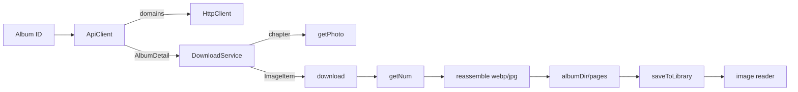

# Architecture Overview

JMFM follows a frontend/backend split: `src/config` holds centralized configuration, `src/core` carries all business logic, and `src/web` is the React Web UI running inside the Capacitor shell.

## Directory Layout

```
src/
  config/                 # Centralized config (app-config.json + typed loader)
    app-config.json
    index.ts
  core/                   # Business core, UI-free
    api/                  # API channel (client auth & retry + parse pure parsing + shared domains)
    constants/            # Constants (algorithm thresholds, request params)
    crypto/               # MD5 / AES-256-ECB
    model/                # Domain models (Album / Photo / ImageItem / blocklist / extension set)
    net/                  # HttpClient interface + Fetch / Capacitor native impls + unified retry
    fs/                   # FileSystem abstraction (atomic writes, SAF adapters)
    transcode/            # Strip math + image reassembly
    download/             # Download orchestration (shared pages + scheduler concurrency/memory + Runtime)
    update/               # In-app updates (version check, APK streaming + SHA-256 verify)
    util/                 # UTF-8 / Base64 / SHA-256 / filename sanitizing
  data/                   # Unified persistence (user-storage: Preferences / localStorage; storage-keys)
  web/                    # UI layer (React DOM + CSS, runs in Capacitor shell)
    assets/               # Icons (Iconify SVG) and fonts (woff2)
    components/           # Presentational components
    download/             # Runtime assembly / SAF runtime / task cleanup
    hooks/                # download / cover / keyboard / gesture / repair hooks
    library/              # insert / cover / cover cache / path resolve / repair / daily / cache / dismissed
    reader/               # direct image reading (image-doc / image-loader / image-reader / pdf-doc)
    screens/              # 5 screens (Home / Library / Tasks / Settings / Reader)
    stores/               # zustand stores
    styles/               # CSS style modules
    theme/                # Cirrus design tokens (CSS variables)
    generated/            # icons.ts (generated from SVG)
    App.tsx / main.tsx / index.html
__tests__/                # unit tests (20 files / 149 cases); helpers/ holds test-only code
scripts/
  verify-download.ts      # Node-side full download pipeline verification
  node-runtime.ts         # Node runtime (ImageMagick decode)
  bench-reader-flow.ts    # reader scroll-window desktop bench
  shared/axios-http.ts    # axios client for scripts only
capacitor.config.ts       # Capacitor config (appId / webDir / plugins)
android/                  # Capacitor-generated Android native project
```

## Layer Dependencies



- **net / api / model**: data fetching and modeling.
- **transcode**: pure algorithms for image restoration.
- **download**: orchestration on `DownloadRuntime`; the hot path writes `pages/` only.
- **runtime**: Capacitor native (Filesystem + Canvas), SAF, in-memory Web, and Node (ImageMagick) share one interface.

## Full Data Flow



## Design Principles

- **Interface isolation**: `ContentSource` for fetch; `DownloadRuntime` for write/decode — core stays UI-free.
- **Pure functions**: `getNum`, `computeStrips` are unit-testable.
- **Config-driven**: domains, secrets, headers, concurrency, timeouts from `app-config.json`.
- **Pluggable HttpClient**: Web uses `FetchHttpClient`; device uses `NativeHttpClient` (bypasses CORS, with fetch fallback), selected via `Capacitor.isNativePlatform()`; axios only for Node scripts (`scripts/shared/axios-http.ts`).
- **Unified retry**: `requestWithRetry` in `core/net/retry.ts` centralizes the domain-rotation × retry loop; `retryable` distinguishes 4xx/5xx; `fetchOnce` uses `AbortSignal.timeout`.
- **Domain protocol**: each domain tries `https://` first, then `http://` as fallback; `refreshDomains` is shared globally and probed at most once.
- **pages primary path**: downloads write `pages/` only (default webp) with atomic writes (`.tmp` + rename) against half-written files; reader renders local images; legacy PDFs via pdf.js.
- **Serial queue**: `src/web/download/queue.ts`, `MAX_CONCURRENT = 1`; pause/fail advances to next.
- **Download memory control**: `download/scheduler.ts` provides `MemoryGate` byte watermark and `Semaphore` decode throttling.
- **Cover preload**: `coverCache` pre-decodes cover URIs on start / library change; first 8 covers eagerly, the rest lazy.
- **Unified persistence**: `data/user-storage.ts` abstracts Preferences (native) / localStorage (web); keys centralized in `storage-keys.ts`.
- **Repair files**: Settings scans and backfills missing pages, covers, and metadata; path changes auto-remap.
- **Daily recommendations**: whitelist first → favorite tags → time-tiered fill (today first, then earlier days); cached per day with dismiss support.
- **In-app updates**: APK streamed in chunks with incremental SHA-256 verification, avoiding whole-file memory residency.
