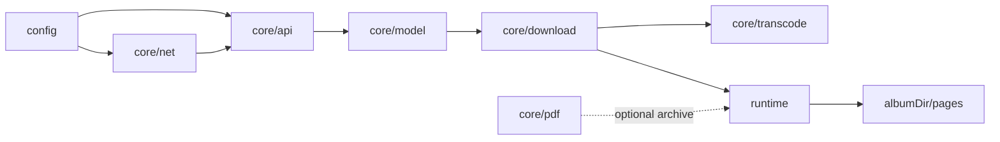
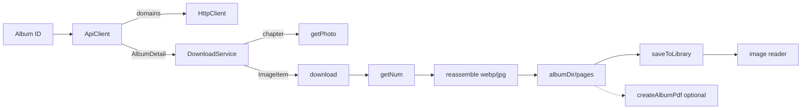

# Architecture Overview

JMFM follows a frontend/backend split: `src/config` holds centralized configuration, `src/core` carries all business logic, and `src/web` is the React Web UI running inside the Capacitor shell.

## Directory Layout

```
src/
  config/                 # Centralized config (app-config.json + typed loader)
    app-config.json
    index.ts
  core/                   # Business core, UI-free
    api/                  # API channel (domains, token, decryption, image URLs)
    constants/            # Constants (algorithm thresholds, request params, PDF sizes)
    crypto/               # MD5 / AES-256-ECB
    model/                # Domain models (Album / Photo / ImageItem)
    net/                  # HttpClient interface + Axios / Capacitor native impls
    parser/               # HTML parsing + Base64 (fallback channel)
    pdf/                  # PDF layout (uniform width, size calculation)
    transcode/            # Strip calculation + image reassembly
    download/             # Download orchestration (DownloadService + Runtime abstraction)
    util/                 # UTF-8 / Base64 utilities
  data/                   # Settings persistence (storage interface) + mock data
  web/                    # UI layer (React DOM + CSS, runs in Capacitor shell)
    assets/               # Icons (Iconify SVG) and fonts
    components/           # Presentational components
    download/             # Download serial queue
    hooks/                # download / cover / keyboard / gesture hooks
    library/              # insert / cover cache / library repair
    reader/               # direct image reading (image-doc / image-loader / image-reader / pdf-doc)
    screens/              # 5 screens (Home / Library / Tasks / Settings / Reader)
    stores/               # zustand stores
    styles/               # CSS style modules
    theme/                # Cirrus design tokens (CSS variables)
    generated/            # icons.ts (generated from SVG)
    App.tsx / main.tsx / index.html
scripts/
  verify-download.ts      # Node-side full pipeline verification
  node-runtime.ts         # Node runtime (ImageMagick decode + PDF)
capacitor.config.ts       # Capacitor config (appId / webDir / plugins)
android/                  # Capacitor-generated Android native project
```

## Layer Dependencies



- **net / api / model**: data fetching and modeling.
- **transcode**: pure algorithms for image restoration.
- **download**: orchestration on `DownloadRuntime`; the hot path writes `pages/` only.
- **runtime**: Capacitor native (Filesystem + Canvas), in-memory Web, and Node (ImageMagick) share one interface; `createAlbumPdf` remains for optional archives.

## Full Data Flow



## Design Principles

- **Interface isolation**: `ContentSource` for fetch; `DownloadRuntime` for write/decode — core stays UI-free.
- **Pure functions**: `getNum`, `computeStrips`, `computeUniformWidth`, `scaleSize` are unit-testable.
- **Config-driven**: domains, secrets, headers, PDF params from `app-config.json`.
- **Pluggable HttpClient**: Web/Node use `AxiosHttpClient`; device uses `NativeHttpClient` (bypasses CORS), selected via `Capacitor.isNativePlatform()`.
- **pages primary path**: downloads write `pages/` only (default webp); reader renders local images; PDF optional, legacy PDFs via pdf.js.
- **Serial queue**: `src/web/download/queue.ts`, `MAX_CONCURRENT = 1`; pause/fail advances to next.
- **Cover preload**: `coverCache` pre-decodes cover URIs on start / library change to reduce tab-switch layout jump.
- **Library repair**: Settings runs three checks (metadata / format+count / cover); failing items deleted and re-queued.
