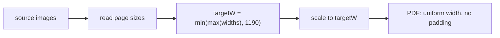

# PDF Generation

`src/core/pdf/` assembles restored images into a uniformly readable PDF.

> Note: PDFs are **archive artifacts**. New downloads also keep the `albumDir/pages/` image sequence; the reader uses direct image reading as the primary path (instant open). PDFs are rendered with pdf.js only as a fallback for legacy files without `pages/`.

## Uniform Width

Original image widths can differ. The target width is derived dynamically:

```typescript
// src/core/pdf/layout.ts
export function computeUniformWidth(widths: number[], maxWidth: number): number {
  return Math.min(Math.max(...widths), maxWidth);
}
```

- Takes the maximum source width, so the widest page is never upscaled (shrink only).
- Caps at `PDF.MAX_WIDTH` (default 1190) when it exceeds the limit.
- Every page scales proportionally to the target width; the page size equals the scaled image size, with no white padding.



## Size Calculation

`scaleSize(width, height, targetWidth)` scales proportionally and rounds the result.

## Page Building

`buildPdfPages(imagePaths, sizes?)` in `src/core/pdf/index.ts`:

- With sizes: builds each page at its actual scaled dimensions with `imageFit: 'fill'`.
- Without sizes: falls back to fixed A4 with `contain`, staying usable.

## pdf-lib Rendering

`buildPdfBytes(pages, readImage)` generates the binary with `pdf-lib`:

1. `PDFDocument.create()` to create the document.
2. Per page, `embedPng` / `embedJpg` (chosen by extension).
3. `addPage([width, height])` then `drawImage` filling the whole page, no padding.

The Capacitor native runtime reads temp image bytes via `fs.readFile` and hands them to `buildPdfBytes`.

## Node Runtime (ImageMagick)

`createPdfWithMagick` in `scripts/node-runtime.ts`:

1. `identify` all image widths.
2. `computeUniformWidth` to get the target width.
3. `magick imgs... +repage -resize {W}x output.pdf`.

> `+repage` must come before `-resize` to clear the virtual-page metadata left by strip cropping; otherwise the MediaBox is wrong, producing tiny pages and white placeholders.

## File Naming

`buildFileName(title)`: names the PDF after the comic title, replacing illegal characters and truncating to `TITLE_MAX_LEN` (200).

```text
[五月雨汉化组]实际上只是、想在一起.pdf
```

## Configuration

The `pdf` section of `src/config/app-config.json`: page width/height, max width/height, title length limit, background color.
