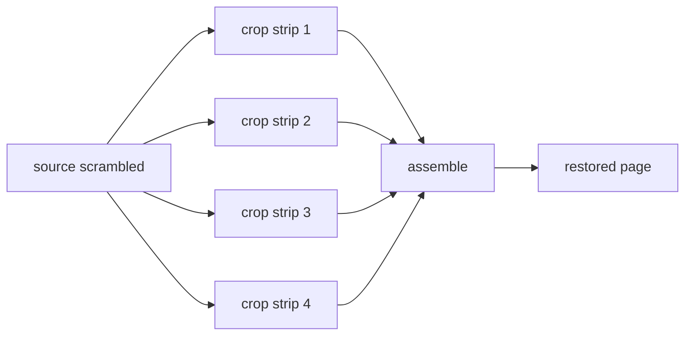

# Image Decryption & Reassembly

Comic images are split into strips and scrambled. `src/core/transcode/` computes the strips and reassembles the original page.

## Strip Count Calculation

`getNum(scrambleId, aid, fileName)` (`src/core/transcode/index.ts`):

```typescript
if (aid < scrambleId) return 0;              // not scrambled
if (aid < SCRAMBLE_268850) return 10;        // legacy albums: fixed 10
const x = aid < SCRAMBLE_421926 ? 10 : 8;    // middle tier: 10, newer: 8
const s = md5Hex(`${aid}${fileName}`);
return s.charCodeAt(s.length - 1) % x * 2 + 2; // 2,4,6,...,20
```

A result of 0 means the image is not split and can be used directly; n means the image was split into n strips.

## Strip Geometry

`computeStrips(num, height)` computes each strip's source crop region and target position:

- Divides the image height evenly by the strip count.
- The first strip absorbs the remainder.
- Strips are read bottom-to-top in the source and placed top-to-bottom in the target, i.e. **reversed order**.

```typescript
export function computeStrips(num: number, height: number): Strip[] {
  const over = height % num;
  const base = Math.floor(height / num);
  // ...
  // each strip: {ySrc (source crop offset), yDst (target offset), height}
}
```

## Reassembly Flow

With n=4 and height 1371:



## Runtime Implementations

`decodeAndSave(num, encoded, ext)` has two implementations:

- **Capacitor / Web (Canvas)**: `src/core/transcode/decode.ts` decodes with `createImageBitmap`, draws each strip into its target position with `canvas.drawImage`, and outputs PNG via `toBlob`.
- **Node (ImageMagick)**: `scripts/node-runtime.ts` crops strips with `-crop` and appends with `-append +repage`.

> Key detail: after ImageMagick cropping, `+repage` is required to reset the virtual page metadata; otherwise stale canvas dimensions survive the append and you get tiny images with blank areas.

## Format Strategy

`decideImageStrategy(num, ext)`:

- `gif` or `num <= 0`: `raw`, saved as-is.
- `num <= 1` and not webp: `raw`, saved as-is.
- otherwise: `reassemble`, goes through the strip pipeline.
