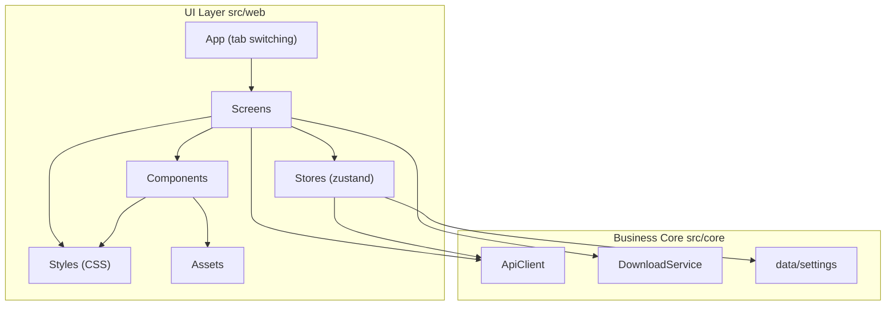
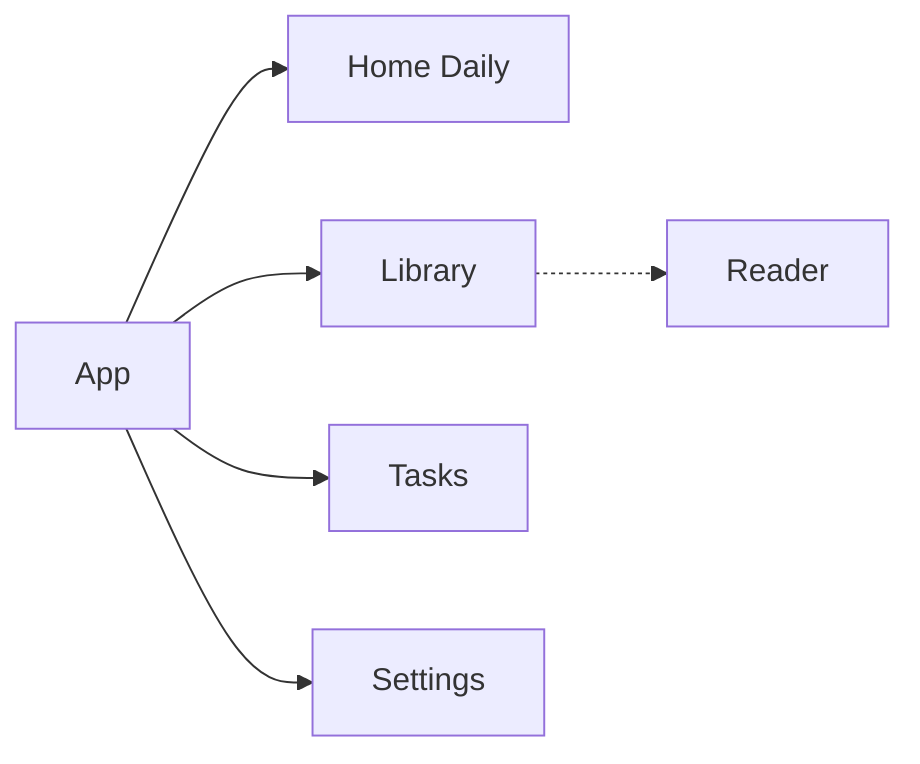
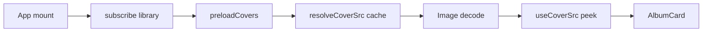
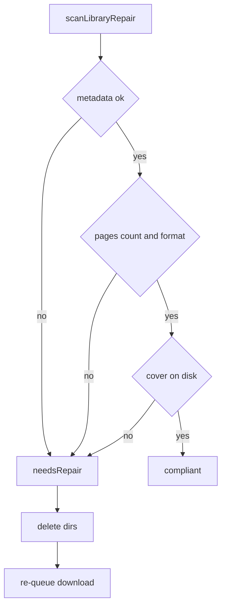

# UI Architecture

The JMFM UI layer lives in `src/web` (React DOM + CSS) inside the Capacitor WebView, fully separated from the business core `src/core`. The UI consumes business capabilities through three entry points only: `ApiClient`, `DownloadService` and `Settings`. It never touches networking, crypto or file logic directly.

## Layering



- **App**: lightweight state-based tab switching hosting the 4 main screens (no routing library).
- **Screens**: page-level components responsible only for composition and event dispatch, with no business implementation.
- **Stores**: zustand stores for UI state, bridging the core services.
- **Components**: presentational components without business semantics.
- **Styles**: all styles are separate CSS files under `src/web/styles/`; tsx files contain no inline style sheets.
- **Assets**: icons (Iconify SVG) and fonts (Alimama / BebasNeue) are stored centrally.

## Navigation



### Page table

| Name | Component | Description |
| --- | --- | --- |
| `Home` | `HomeScreen` | daily recommendation feed |
| `Library` | `LibraryScreen` | local library + search + category filters (all / favorite / downloaded / recent) |
| `Tasks` | `TasksScreen` | download queue and progress (serialized) |
| `Settings` | `SettingsScreen` | app settings |
| `Reader` | `ReaderScreen` | reader: direct image reading (new downloads) or pdf.js fallback (legacy PDFs) |

## Screen responsibilities

- **Home**: shows daily recommendation cards (cover, title, author, tags, chapter count). Currently mock-driven; a recommendation API will be wired later.
- **Library**: lists downloaded albums with search and four category filters (all / favorite / downloaded / recent); supports favorite, delete and open. Delete uses `ConfirmDialog`.
- **Tasks**: download queue with live progress, pause / resume / delete; albums serialized via `queue.ts`; done tasks leave after 3s with a GSAP height collapse; card is left-aligned title + status badge (no check icon).
- **Reader**: when `ReaderTarget.pagesDir` exists on native, uses direct image reading (`image-reader.tsx` + `image-loader.ts`): scroll window ±1/+8, horizontal three-slide track; otherwise pdf.js fallback.
- **Settings**: download path, retry, concurrency, image format, proxy; **General → Repair library** scans and re-queues failing items.

## Cover preload



- `src/web/library/coverCache.ts`: URI cache + inflight dedupe + `preloadCovers`.
- Warmed on app start / library change and after insert, so tab switches do not jump from cover loads.

## Library repair



## State management

| Store | Responsibility |
| --- | --- |
| `useSettingsStore` | wraps `data/settings` load and persistence (Capacitor Preferences / localStorage) |
| `useDownloadStore` | download task set and progress (pending / running / paused / done / error) |
| `useLibraryStore` | locally downloaded albums (`LibraryItem`, with `pagesDir` / `coverPath`), favorite / recent / delete |

## Style system

Built on the Cirrus design tokens in `src/web/theme/index.css` (CSS variables: surface / ink / accent / radii / shadow / spacing / typography / easing).

- Page and component styles live in separate CSS files under `src/web/styles/`; tsx files contain no inline styles.
- Palette: `ink` primary text, `accent-primary` primary action, `accent-success` success, `accent-danger` danger, `surface` surfaces, `shadow-1/2` layered elevation, `ease-spring` springy motion.

## Asset conventions

### Icons

- Source: [Iconify Material Symbols](https://icon-sets.iconify.design/material-symbols/), stored as SVG files in `src/web/assets/icons/`.
- `scripts/gen-icons.ts` generates `src/web/generated/icons.ts` (an SVG string map).
- The `Icon` component renders them inline with `dangerouslySetInnerHTML`; icons use `currentColor`, so the color comes from surrounding CSS.
- Tab icons: `home`, `auto-stories`, `download`, `settings`.

### Fonts

| File | fontFamily | Usage |
| --- | --- | --- |
| `AlimamaShuHeiTi-Bold.woff2/.ttf` | `Alimama ShuHeiTi` | Chinese titles, branding |
| `BebasNeue.woff2` | `Bebas Neue` | Latin and numerals, display type |

- Source fonts are stored in `src/web/assets/fonts/`.
- `src/web/styles/fonts.css` registers them via `@font-face`; Bun build bundles them automatically (small fonts are inlined as data URIs).

## Directory layout

```
src/web/
  assets/
    fonts/                # Alimama / BebasNeue / Nagino
    icons/                # Iconify SVG
  components/             # Icon / AlbumCard / ConfirmDialog / SearchBar / ...
  download/               # download serial queue (queue.ts)
  generated/              # icons.ts (generated)
  hooks/                  # useDownloadTask / useCoverSrc / useKeyboardVisibility / ...
  library/                # saveToLibrary / coverCache / repairLibrary
  reader/                 # image-doc / image-loader / image-reader / pdf-doc
  screens/                # Home / Library / Tasks / Settings / Reader
  stores/                 # zustand stores
  styles/                 # CSS style modules
  theme/                  # Cirrus tokens (CSS variables)
  App.tsx                 # tab switching + cover warm + full-screen Reader
  main.tsx                # ReactDOM.createRoot entry
  index.html              # WebView host page
```

## Build & run

```bash
bun run build            # bun build → dist/
bunx cap sync android    # sync web assets into the native project
bunx cap run android     # build and run on a connected device
bash scripts/dev-android.sh   # one shot: build → sync → run (device first)
bun run apk              # one shot debug APK → dist-apk/
```
