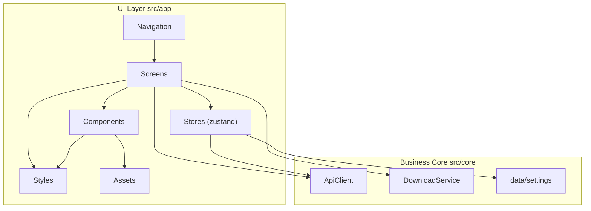
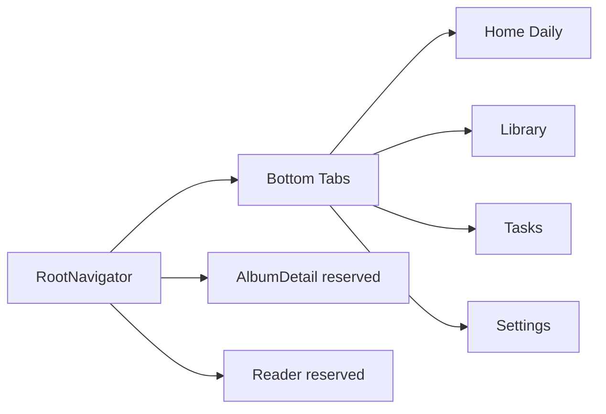

# UI Architecture

The JMFM UI layer lives in `src/app` and is fully separated from the business core `src/core`. The UI consumes business capabilities through three entry points only: `ApiClient`, `DownloadService` and `Settings`. It never touches networking, crypto or file logic directly.

## Layering



- **Navigation**: `@react-navigation` organizes routes; bottom-tabs hosts the 4 main pages, native-stack hosts secondary pages like detail and reader.
- **Screens**: page-level components responsible only for composition and event dispatch, with no business implementation.
- **Stores**: zustand stores for UI state, bridging the core services.
- **Components**: presentational components without business semantics.
- **Styles**: all styles live in separate modules under `src/app/styles/`; tsx files contain no `StyleSheet`.
- **Assets**: icons (Iconify SVG) and fonts (Alimama / BebasNeue) are stored centrally.

## Navigation



### Route table

| Name | Component | Description |
| --- | --- | --- |
| `Home` | `HomeScreen` | daily recommendation feed |
| `Library` | `LibraryScreen` | local library + search |
| `Tasks` | `TasksScreen` | download queue and progress |
| `Settings` | `SettingsScreen` | app settings |
| `AlbumDetail` | reserved | album detail page |
| `Reader` | reserved | image reader page |

## Screen responsibilities

- **Home**: shows daily recommendation cards (cover, title, author, tags, chapter count). Currently mock-driven; a recommendation API will be wired later.
- **Library**: lists downloaded albums with search and sorting.
- **Tasks**: shows the download queue with live progress, supports pause / resume / delete.
- **Settings**: download path, retry count, concurrency, image format, proxy; reads and writes `data/settings`.

## State management

| Store | Responsibility |
| --- | --- |
| `useSettingsStore` | wraps `data/settings` load and persistence |
| `useDownloadStore` | download task set and progress (pending / downloading / paused / done) |
| `useLibraryStore` | locally downloaded albums, persisted in AsyncStorage |
| `useHistoryStore` | browse history (reserved) |

## Style system

Built on the Cirrus design tokens in `src/app/theme/index.ts` (`colors` / `radii` / `shadow` / `typography` / `spacing` / `easing`).

- Page and component styles live in separate files under `src/app/styles/`; tsx files contain no inline styles.
- Palette: `ink` primary text, `signal` primary action, `citrus` accent, `meadow` success, `lightFill` surface, `edge` divider.

## Asset conventions

### Icons

- Source: [Iconify Material Symbols](https://icon-sets.iconify.design/material-symbols/), stored as SVG files in `src/app/assets/icons/`.
- The `Icon` component renders them via `SvgXml` from `react-native-svg`; icons use `currentColor`, so the color is injected by the caller.
- Tab icons: `home`, `auto-stories`, `download`, `settings`.

### Fonts

| File | fontFamily | Usage |
| --- | --- | --- |
| `AlimamaShuHeiTi-Bold.ttf` | `AlimamaShuHeiTi-Bold` | Chinese titles, branding |
| `BebasNeue-Regular.ttf` | `BebasNeue-Regular` | Latin and numerals, display type |

- Source fonts are stored in `src/app/assets/fonts/`.
- Android fonts are registered in `android/app/src/main/assets/fonts/` (loaded automatically).
- The iOS project is in place with fonts in `ios/JMFMobile/Fonts/`; `Info.plist` registration will be added later (Android is the current target).

## Directory layout

```
src/app/
  assets/
    fonts/                # Alimama / BebasNeue
    icons/                # Iconify SVG
  components/             # Icon / AlbumCard / SearchBar / ...
  navigation/             # RootNavigator
  screens/                # Home / Library / Tasks / Settings
  stores/                 # zustand stores
  styles/                 # style modules
  theme/                  # Cirrus tokens
  App.tsx
```
